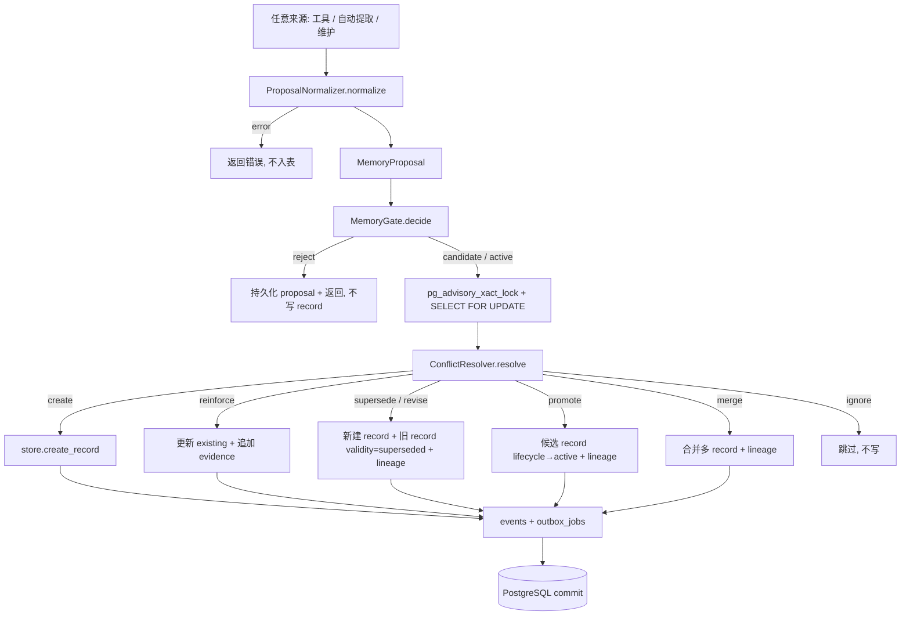
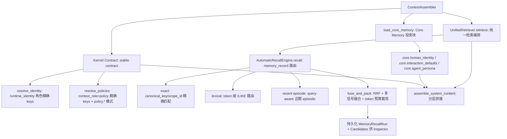
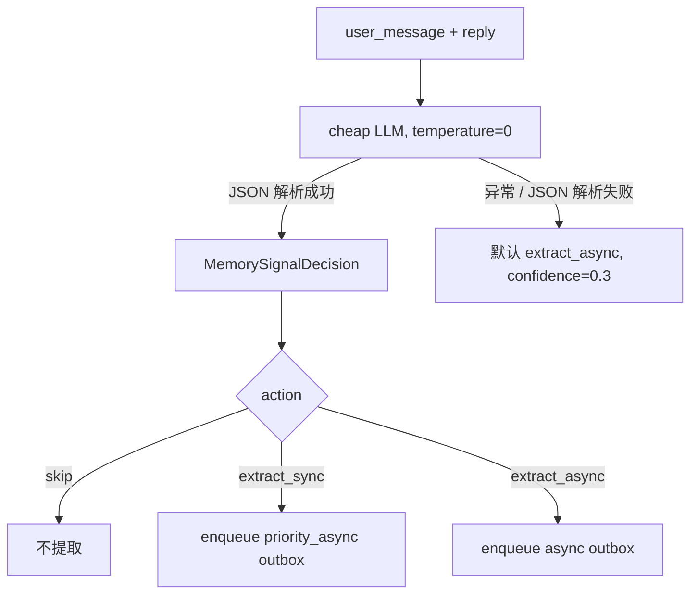
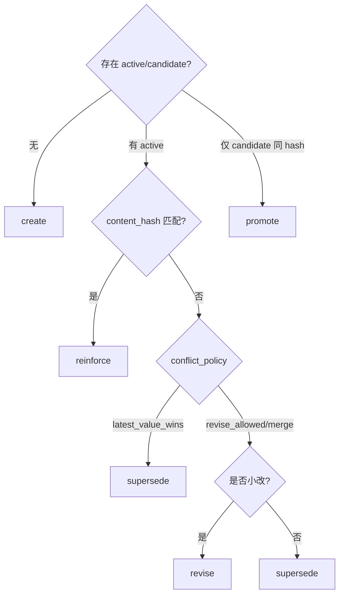

# AIive 记忆系统架构设计文档

> 版本: 2.0 | 日期: 2026-07-10 | 基于终局架构重构
>
> 本文档已与 `backend/aiive/memory/`、`backend/aiive/runtime/agent_graph.py`、
> `backend/aiive/tools/builtin_tools.py`、`backend/aiive/core/action_planner.py`、
> `backend/aiive/worker/outbox_handlers.py` 的实际代码逐一核对。

---

## 目录

1. [架构全景](#一架构全景)
2. [完整调用链](#二完整调用链)
3. [记忆信号分类（ActionPlanner）](#三记忆信号分类actionplanner)
4. [类型系统](#四类型系统)
5. [三套独立状态](#五三套独立状态)
6. [写入管线的组件](#六写入管线的组件)
7. [数据库 Schema](#七数据库-schema)
8. [并发策略与事务边界](#八并发策略与事务边界)
9. [三个实例：机制与效果](#九三个实例机制与效果)
10. [信任边界](#十信任边界)
11. [废弃清单](#十一废弃清单)
12. [已知遗留问题](#十二已知遗留问题)
13. [关键源码索引](#十三关键源码索引)

---

## 一、架构全景

```
                           ┌──────────────────────┐
                           │    用户聊天请求        │
                           └──────────┬───────────┘
                                      │
                            ┌─────────▼──────────┐
                            │   AgentGraph.run()  │
                            │  ┌────────────────┐ │
                            │  │ MemoryReadModel │ │ ← 上下文读取（精确key+type）
                            │  │  (R. Identity + │ │
                            │  │   Policy +       │ │
                            │  │   User Memories) │ │
                            │  └────────────────┘ │
                            │  ┌────────────────┐ │
                            │  │  LangGraph LLM  │ │ ← 主对话
                            │  │  + tool_calls   │ │
                            │  └────────────────┘ │
                            │  ┌────────────────┐ │
                            │  │  _finalize()    │ │
                            │  │  ├ classify()   │ │ ← 模型分类（非关键词）
                            │  │  ├ SKIP/ASYNC/  │ │
                            │  │  │   SYNC 路由   │ │
                            │  │  └ commit()     │ │
                            │  └────────────────┘ │
                            └─────────┬──────────┘
                                      │
              ┌───────────────────────┼───────────────────────┐
              │                       │                       │
    ┌─────────▼────────┐   ┌─────────▼────────┐   ┌─────────▼────────┐
    │ 显式工具调用        │   │ 模型分类=SKIP     │   │ 模型分类=EXTRACT  │
    │ remember_or_update│   │                  │   │                  │
    │ forget_memory    │   │ 不做任何提取       │   │ enqueue outbox    │
    └────────┬─────────┘   └──────────────────┘   └────────┬─────────┘
             │                                              │
    ┌────────▼──────────────────────────────────────────────▼─────────┐
    │                    MemoryWriteService (唯一写入入口)              │
    │  ┌───────────┐  ┌──────────┐  ┌────────────────┐               │
    │  │ Proposal  │→│ Memory   │→│ Conflict       │               │
    │  │ Normalizer│ │ Gate     │ │ Resolver       │               │
    │  └───────────┘  └──────────┘  └───────┬────────┘               │
    │                                       │                        │
    │  ┌────────────────────────────────────▼───────────────────────┐│
    │  │  PostgreSQL 事务 (强一致边界)                                ││
    │  │  ├─ advisory lock (pg_advisory_xact_lock)                   ││
    │  │  ├─ memory_records (INSERT/UPDATE)                          ││
    │  │  ├─ memory_evidence (INSERT)                                ││
    │  │  ├─ memory_lineage (INSERT)                                 ││
    │  │  ├─ memory_proposals (INSERT)                               ││
    │  │  ├─ events (INSERT)                                         ││
    │  │  └─ outbox_jobs (INSERT - projection tasks)                 ││
    │  └─────────────────────────────────────────────────────────────┘│
    └─────────────────────────────────────────────────────────────────┘
                                      │
                          ┌───────────▼──────────┐
                          │  TaskWorker (同请求内  │
                          │  poll_and_notify 消费) │
                          │  ├ memory_extraction   │ ← EXTRACT_ASYNC 路径
                          │  ├ vector_upsert       │ (Qdrant, stub)
                          │  ├ markdown_project    │ (Projection)
                          │  └ cache_invalidate    │ (Context Cache)
                          └────────────────────────┘
```

### 1.1 写入管线流程图（Mermaid）



### 1.2 读取流程图（Mermaid）



---

## 二、完整调用链

### 2.1 主聊天流程

```
POST /api/chat                                                          [routes_chat.py]
  └─ invoke_chat(message, thread_id)                                    [graph.py]
       └─ db = SessionLocal()
       └─ AgentGraph(llm_client, db).run(message, thread_id)            [agent_graph.py]
            │
            ├─ 1. 上下文构建（V2 分层读取架构）
            │   _build_agent_context(message, thread, trace_id)
            │     ├─ Kernel Contract: _build_stable_contract()
            │     │   ├─ resolve_identity()
            │     │   │   └─ store.get_by_context_roles(["runtime_identity"])
            │     │   │       精确 key 查询: agent.display_name, user.display_name,
            │     │   │       user.name, agent.persona.relationship,
            │     │   │       user.preference.response_style (5 个被注入字段)
            │     │   └─ resolve_policies()
            │     │       └─ store.get_by_context_roles(["policy"])
            │     │           精确 key + policy.* 模式键查（不再每轮注入全部 tasks）
            │     ├─ Core Memory 投影: load_core_memory()
            │     │   └─ core.human_identity / core.interaction_defaults / core.agent_persona
            │     │       仅 MemoryKeyRegistry 中声明 core_memory_role 的键可进入；token 预算裁剪
            │     └─ Automatic Recall: AutomaticRecallEngine.recall(query=message)
            │         query-aware 多路由（exact / fts / recent episode）→ 融合 → token 预算裁剪
            │         每次召回持久化 MemoryRecallRun + Candidates 供 Context/Retrieval Inspector
            │
            │   → 构建 SystemMessage（assemble_system_content 分层拼接）:
            │     ## Stable System Contract（Kernel Contract）
            │     ## Core Memory（小、稳定、标注为非指令）
            │     ## Retrieved Historical Memory（evidence，明确标注非系统指令）
            │
            ├─ 2. LangGraph 执行 (LLM + tool_calls + policy_check)
            │    assistant → policy_check → [tools → assistant] → END
            │
            └─ 3. _finalize() 终结处理
                 ├─ 记录 event + tool_result
                 │
                 ├─ classify_memory_signal(user_message, reply)
                 │   └─ ActionPlanner 用便宜模型做结构化分类 (temperature=0)
                 │       返回 MemorySignalDecision { action, confidence, reason }
                 │       action ∈ { skip, extract_sync, extract_async }
                 │
                 ├─ SKIP: 不做任何提取，不 enqueue
                 ├─ EXTRACT_SYNC: enqueue 高优先级 outbox job (memory_extraction)
                 │   └─ payload.extraction_mode = priority_async
                 ├─ EXTRACT_ASYNC: enqueue 普通 outbox job (memory_extraction)
                 │   └─ payload.extraction_mode = async
                 │
                 ├─ Turn/Event/Outbox 在 _finalize_turn() 同一事务提交
                 └─ Worker handle_memory_extraction()
                     ├─ MemoryExtractionPolicy.should_skip_system_message() 结构性检查
                     ├─ UnifiedMemoryExtractor.extract() LLM 提取
                     └─ MemoryWriteService.write_batch() 事务写入
```

> 说明：自动记忆提取统一由 Outbox Worker 执行。原 `EXTRACT_SYNC` 不再在
> Turn finalize 前直接写记忆，而是保留为 `priority_async` 调度提示；因此自动提取
> 对当前请求不承诺立即可见。显式 `remember_or_update` 工具仍同步写入。

### 2.2 显式工具调用流程

```
LLM tool_call "remember_or_update"                                [builtin_tools.py]
  └─ _handle_remember_or_update(db, ctx, content, type, key)
       │
       ├─ ProposalNormalizer.normalize()                          [proposal_normalizer.py]
       │    ├─ 类型映射: legacy type → canonical type
       │    ├─ key 解析: MemoryKeyRegistry.resolve(key)
       │    ├─ scope 推断: global/project/thread/...
       │    ├─ evidence 构建 (source_type="user_message", trust_level="trusted")
       │    └─ 输出: MemoryProposal (request_idempotency_key 自动计算)
       │
       └─ MemoryWriteService.write(proposal, run_context=ctx)
            │                                                [memory_write_service.py]
            ├─ MemoryGate.decide(proposal)                    [memory_gate.py]
            │    ├─ 类型验证 (必须为 canonical 8 种之一)
            │    ├─ 信任边界: 敏感类型需要 trusted user evidence
            │    ├─ 外部内容不能写 user_profile/policy/agent_self
            │    ├─ assistant reply 不能独立强化用户画像
            │    ├─ 置信度 < 0.7 → candidate
            │    └─ 无 evidence → candidate
            │
            ├─ 获取 advisory lock (canonical_key + scope hash)
            ├─ SELECT FOR UPDATE 已有 active/candidate records
            ├─ ConflictResolver.resolve()                      [conflict_resolver.py]
            │    ├─ 无已有: create
            │    ├─ single + 同hash: reinforce
            │    ├─ single + 不同: supersede / revise
            │    ├─ candidate + 同hash: promote
            │    ├─ multi + 同hash: reinforce (去重)
            │    ├─ multi + 不同: create
            │    └─ merge (多记录合并，由 conflict_policy=merge 触发)
            │
            ├─ 原子写入:
            │    ├─ memory_records (INSERT/UPDATE)
            │    ├─ memory_evidence (INSERT)
            │    ├─ memory_lineage (revise/supersede/merge/promote)
            │    ├─ memory_proposals (INSERT, 持久化审计)
            │    ├─ events (memory.created/reinforced/superseded/...)
            │    └─ outbox_jobs (vector + markdown + cache)
            └─ _db_handler 提交事务
```

### 2.3 遗忘流程

```
LLM tool_call "forget_memory"                                    [builtin_tools.py]
  └─ _handle_forget_memory(db, ctx, memory_id, scope, target)
       │  scope 支持: memory_id(默认) / memory_key / topic / all
       └─ MemoryWriteService.forget(memory_id, reason, run_context) [memory_write_service.py]
            ├─ content → tombstone (不可逆，格式: "forgotten:{id[:8]}:{ISO8601}")
            ├─ structured_value → NULL
            ├─ lifecycle_state → forgotten, validity_state → superseded
            ├─ memory_evidence → DELETE (按 memory_id)
            ├─ event → "memory.forgotten"
            ├─ outbox → projection cleanup (vector_delete + cache_invalidate)
            └─ ForgetRequest → 审计记录 (tombstone)
```

### 2.4 维护流程

```
LLM tool_call "run_memory_maintenance"                           [builtin_tools.py]
  └─ _handle_run_memory_maintenance(db)
       └─ MemoryMaintenance(db).scan()
            ├─ 扫描 active/candidate/sleeping 记录
            ├─ stale (>7d 未观测, 非 protected): stale_candidates
            ├─ candidate 过期 >7d: archive_candidates
            ├─ sleeping 过期 >30d: archive_candidates
            └─ protected 类型 (user_profile/policy/agent_self) 仅 sleep 不 archive
                → generate_sleep_proposals / archive_proposals / wake_proposals
                → 仍经 MemoryWriteService.execute_maintenance() 执行
```

---

## 三、记忆信号分类（ActionPlanner）

所有"是否提取记忆 / 何时提取"的语义判断都由 `ActionPlanner.classify_memory_signal()` 完成，
**完全不依赖关键词表**。



分类提示词（节选）定义了三类动作：
- `skip`：纯问候、简单应答、瞬时问题报告（"我代码报错了"）、闲聊、一次性事实提问 → 不提取。
- `extract_async`：含偏好、事实、习惯、项目细节或以后可能有用的信息 → 入队后台处理。
- `extract_sync`：含明确的身份变更、策略规则或关键纠正 → 作为 `priority_async` 入队优先处理，不保证当前请求内可见。

`MemorySignalDecision` 字段：`action` / `confidence` / `reason`。
与 `intent_type`、`execution_mode` **完全解耦**——分类只看对话内容语义。

> 注意：`MemoryExtractionPolicy.resolve_action(signal_action, user_message)` 是将模型信号与
> 结构性规则（系统消息跳过）结合的辅助函数；主路径 `_finalize()` 直接读取 `signal.action`，
> 并在 outbox handler 中用 `should_skip_system_message()` 做结构性守卫。

---

## 四、类型系统

### 4.1 Canonical MemoryType (8种)

| 类型 | 值 | 说明 | 示例 key |
|------|---|------|----------|
| `user_profile` | user_profile | 用户身份、偏好、习惯、日程、规律 | user.display_name, user.preference.*, user.routine.* |
| `agent_self` | agent_self | Agent 名称、人格、关系风格 | agent.display_name, agent.persona.* |
| `project` | project | 项目决策、技术栈、架构 | project.aiive.backend_stack |
| `policy` | policy | 规则、约束、禁止事项 | policy.no_external_tools |
| `procedural` | procedural | 工作流、执行方法、经验教训 | procedural.git_workflow |
| `episodic` | episodic | 值得记住的一次性事件 | episodic.meeting_20260710 |
| `knowledge` | knowledge | 通用事实和知识 | knowledge.weather_hk |
| `environment` | environment | 环境配置 | environment.db_host |

### 4.2 旧类型映射 (Legacy → Canonical)

| 旧 type | 新 type | 新 canonical_key 推导 |
|---------|---------|----------------------|
| `user_profile` | user_profile | 保留或从 content 推导 |
| `name` | user_profile | user.name 或 user.display_name |
| `preference` | user_profile | user.preference.{topic} |
| `routine` | user_profile | user.routine.{desc} |
| `habit` | user_profile | user.habit.{desc} |
| `schedule` | user_profile | user.schedule.{desc} |
| `agent_self` | agent_self | 保留 |
| `project` | project | project.{name}.{topic} |
| `policy` | policy | policy.{topic} |
| `environment` | environment | environment.{topic} |
| `fact` | knowledge 或 episodic | 从内容推导 |
| 无法判定 | - | 迁移标记为 knowledge, 人工 review |

### 4.3 Scope 合法值

| scope_type | scope_id | 约束 |
|-----------|----------|------|
| `global` | NULL (必须为空) | 全局范围 |
| `project` | 项目名 (必填) | 项目范围（由 `project.<name>.*` key 推导 scope_id=name） |
| `thread` | thread_id (必填) | 会话线程范围 |
| `workspace` | 工作空间标识 (必填) | 工作空间范围 |
| `capability` | capability_id (必填) | 能力范围 |
| `environment` | 环境标识 (必填) | 环境配置范围 |

**上下文召回优先级（6 级链）**: `thread > project > workspace > capability > environment > global`
（由 `recall_models.ScopeContext.chain()` 定义，运行时经 `scope_resolver.build_scope_context` 解析注入）。

---

## 五、三套独立状态

### 5.1 lifecycle_state (生命周期)

```
candidate ──promote──▶ active ──sleep──▶ sleeping ──wake──▶ active
    │                    │                    │
    │ (过期 7d)          │ (forget)           │ (过期 30d)
    ▼                    ▼                    ▼
archived            forgotten            archived

candidate ──X──▶ sleeping  ← 禁止！sleeping 仅用于曾经 active 的记录
```

> 候选提升（promote）当前只在 `MemoryWriteService.write()` 内由 `ConflictResolver` 触发：
> 当存在同 key+scope 的 candidate 且内容哈希一致时，直接 `promote` 为 active。
> **尚无独立的定时任务自动提升 candidate**（见第十二章）。

### 5.2 validity_state (数据效力)

```
valid → superseded → contradicted → expired
```

一个被 supersede 的记录: lifecycle_state 保持原值, validity_state = "superseded"。

### 5.3 lineage_operation (谱系操作)

```
create / reinforce / revise / supersede / merge / promote / sleep / wake / archive / forget
```

**关键区分**:
- `reject` / `ignore` / `discard` 属于 proposal 决策，不是 MemoryRecord 生命周期。
- `superseded` 是 validity_state，不是 lineage_operation。

---

## 六、写入管线的组件

> 文档早期版本称"五个组件"，实际管线由以下协作组件构成：
> `ProposalNormalizer` → `MemoryGate` → `ConflictResolver` → `MemoryWriteService`
> （写入编排）+ `MemoryReadModel` / `AutomaticRecallEngine`（读取侧）+ `UnifiedMemoryExtractor`（提取）。

### 6.1 ProposalNormalizer

**职责**: 将原始输入标准化为 `MemoryProposal`。

```
输入: (content, memory_type_hint, memory_key_hint, confidence, ...)
  │
  ├─ 类型映射: legacy type → canonical type (LEGACY_TYPE_MAP)
  ├─ key 解析: memory_key_hint → canonical_key (MemoryKeyRegistry，精确优先，否则按 type+content 推导)
  ├─ scope 推断: default_scope + key prefix → scope_type + scope_id (project.<name>.* 提取 name)
  ├─ evidence 构建: { source_type, trust_level, relation, content_span }
  ├─ request_idempotency_key 计算: sha256(source_event_ids|extractor|version|index)
  └─ 输出: MemoryProposal (content_hash 由 ConflictResolver 计算)
```

**关键规则**:
- 未知 canonical type → 返回 error（不入表）。
- scope 非法组合 → 回退 global。
- 缺少 key hint → 从映射后的 canonical type + content 推导通用 fallback（如 `user.preference.<slug>`）；旧 type 本身不参与 key 前缀推导。

### 6.2 MemoryGate

**职责**: 信任准入 → reject / candidate / active。`Pure decision logic — 不写库、不查已有记录`。

规则（按优先级）:
1. **类型验证**: 非 canonical type → reject
2. **信任边界**: user_profile/policy/agent_self 需要 trusted user evidence → 否则 reject
3. **外部内容限制**: 全 external evidence → 不能写 user_profile/policy/agent_self → reject
4. **assistant reply 限制**: 全 llm_reply evidence → 不能创建 user_profile → reject
5. **置信度阈值**: < 0.7 → candidate
6. **无 evidence**: → candidate
7. **默认**: active

**不再依赖**: execution_mode, should_execute, intent_type, 任何关键词表。

> 写入权威由 `MemoryPolicyEngine` 集中决定。生产链中的旧来源名称会先映射到
> `EvidenceSourceType` 统一 taxonomy，再按 `AUTHORITY_RULES` 校验；未知来源默认拒绝。
> `user_message/user_command` 映射为 `user_assertion`，`llm_reply` 映射为
> `llm_derivation`，`webpage/pdf/email` 等映射为 `external_claim`。`MemoryGate`
> 不再维护独立的来源权限真相。

### 6.3 ConflictResolver

**职责**: 确定 lineage operation（create / reinforce / supersede / revise / promote / merge / ignore）。

基于 `MemoryKeyRegistry` 的 `cardinality` 与 `conflict_policy` + 内容哈希，纯确定性：

| 条件 | Operation | 新 ID? | Lineage |
|------|-----------|--------|---------|
| 无同 key+scope 的 active/candidate | create | Yes | create |
| single/multi + 同 content_hash | reinforce | **No** | 更新 existing（追加 evidence，confidence +0.05~0.1） |
| single + 不同 + latest_value_wins | supersede | Yes | predecessor→successor |
| single + 不同 + 非 latest_value_wins | revise（小改）/ supersede（大改） | Yes | predecessor→successor |
| candidate + 同 content_hash | promote | **No** | 同 ID promote |
| multi + 多个不同 | merge（若 conflict_policy=merge）或 create | Yes | 合并/新建 |
| 所有 source_event 已计数 | ignore | **No** | 跳过（防重复强化） |

**reinforce**: 不创建新 record，仅增加 `confidence`(+0.05 trusted / +0.1 其它来源计数)、
`reinforce_count`、更新 `last_reinforced_at`，追加 evidence。并以 source_event_id 去重防止重复强化。
**supersede / revise**: 创建新 record，旧 record 的 `validity_state → superseded`，
`superseded_by → new_id`，写入 `memory_lineage`。



### 6.4 MemoryWriteService

**职责**: 事务编排 — lock → resolve → persist → event → outbox。
**所有**记忆写入（create/reinforce/revise/supersede/merge/promote/sleep/archive/forget）
必须经此服务，无模块可直接写 `MemoryStore` 的 write 方法。

事务内操作顺序:
```
BEGIN
  │
  ├─ pg_advisory_xact_lock(canonical_key_hash + scope_hash)
  ├─ SELECT FOR UPDATE (同 key+scope 的 active+candidate records)
  ├─ ConflictResolver.resolve()
  ├─ INSERT/UPDATE memory_records
  ├─ INSERT memory_evidence
  ├─ INSERT memory_lineage (revise/supersede/merge/promote)
  ├─ INSERT memory_proposals (持久化审计)
  ├─ INSERT events
  ├─ INSERT outbox_jobs (projection: vector + markdown + cache)
  │
COMMIT → 释放 advisory lock
```

**candidate 记录**: 不 enqueue vector_upsert（仅在 active 时可搜索），但仍 enqueue markdown projection（供人工 review）。
**forget**: Saga 覆盖 memory_records + evidence + event + outbox + ForgetRequest。
**execute_maintenance**: 处理 sleep/archive/wake（受保护类型只允许 sleep）。手工 `run_memory_maintenance` 经 `ToolOperation` 事务化入队，聊天先展示 `pending maintenance_report` 与入队前诊断快照；真实 `MemoryMaintenanceRun` 完成或 deadletter 后，Worker 在终态事务中追加 `maintenance_report_terminal` Event，并通过线程 WebSocket 更新同一张卡。历史加载按维护 operation ID 折叠终态事件，禁止将入队或 scan 冒充执行完成。

### 6.4.1 记忆提取消息来源契约

消息来源由服务端入口固定为 `user`、`system_command` 或 `runtime_event`，客户端请求模型禁止额外字段，不能通过正文或 payload 将普通消息升级为内部来源。来源贯穿 Turn 的 request Event、AgentGraph 工具 `RunContext`、记忆信号策略与 `memory_extraction` Outbox。只有 `user` 可进入自动记忆提取；系统指令和运行时事件确定性跳过。Worker 再次校验持久化来源；仅历史 Outbox payload 缺少 `message_source` 时兼容 `[runtime event` / `[system command` / `[系统指令]` 前缀，并记录兼容命中。

当前 `/api/chat/system` 是可由本地前端调用的产品端点，其 `system_command` 仅表示内部交互来源和记忆提取隔离，不代表额外权限；未来若赋予高权限，必须另加身份认证和授权边界。

### 6.5 MemoryReadModel / AutomaticRecallEngine

**MemoryReadModel**: 确定性 key + type 查询（非全表扫描）。

```
build_context()
  ├─ resolve_identity()
  │   └─ SELECT WHERE canonical_key IN (runtime_identity 角色精确 keys)
  ├─ policies
  │   └─ store.get_by_context_roles(["policy"]) 精确 key 查
  └─ （动态记忆不再批量注入，改由 Automatic Recall 按 query 召回）
```

**AutomaticRecallEngine**: scope-aware + relevance-ranked（替代旧 `MemoryRetriever`）。

```
recall(MemoryRecallRequest)
  ├─ scope: ScopeContext.chain()  thread → project → workspace → capability → environment → global
  │   （由 Runtime 经 scope_resolver.build_scope_context 注入，含活跃 capability）
  ├─ 多路由融合: working / semantic / temporal / knowledge_graph（按 RecallConfig 加权）
  ├─ 过滤: lifecycle='active' AND validity='valid' AND 命中 scope 链
  ├─ 排序: 路由得分 → importance → recency → query relevance
  └─ 截断: top_k + token_budget（候选写入 memory_recall_candidates，运行写 memory_recall_runs）
```

### 6.6 UnifiedMemoryExtractor

**职责**: 单次 LLM 调用提取所有类型记忆，替代旧 `MemoryExtractor` + `StewardSignalExtractor`。

- 提示词内置 `MEMORY_KEY_GUIDE`，指导 LLM 输出规范 `canonical_key`。
- 输出 `ExtractedMemory[]`：含 `content / memory_type / memory_key / confidence / importance /
  source_span / signal_type`（signal_type ∈ routine/habit/schedule/preference，管家信号增强）。
- 经 `ProposalNormalizer` 标准化为 `MemoryProposal`，evidence 默认 `source_type=user_message,
  trust_level=trusted`。
- 解析失败 / LLM 异常 → 返回空列表（安全降级）。
- 支持 `json_repair` 容错解析。

### 6.7 MemoryExtractionPolicy

**职责**: 纯结构性守卫，不做自然语言判断。

```
should_skip_system_message(msg)
  ├─ 空消息 → true
  └─ 以 "[runtime event" / "[system command" / "[系统指令]" 开头 → true

resolve_action(signal_action, user_message)
  ├─ 空消息 / 系统消息 → SKIP
  ├─ 合法动作 → signal_action（模型决定）
  └─ 非法动作 → EXTRACT_ASYNC（保持分类失败的安全回退语义）
```

**所有语义判断由 `classify_memory_signal()` 完成**，基于模型调用（参见第三章）。

---

## 七、数据库 Schema

### 7.1 memory_records（核心表）

> 实际模型共 **36 列**（文档早期版本称 31 列，缺少 `sensitivity` / `content_hash` /
> `structured_value_hash`，已补）。

| 列名 | 类型 | 说明 |
|------|------|------|
| id | VARCHAR(36) PK | UUID |
| memory_type | VARCHAR(64) | canonical type |
| canonical_key | VARCHAR(256) | 规范化 key |
| cardinality | VARCHAR(16) | single / multi |
| scope_type | VARCHAR(32) | global/project/thread/workspace/capability/environment |
| scope_id | VARCHAR(128) | NULL for global |
| content | TEXT | 记忆内容 |
| structured_value | JSONB | 结构化值 |
| lifecycle_state | VARCHAR(32) | candidate/active/sleeping/archived/forgotten |
| validity_state | VARCHAR(32) | valid/superseded/contradicted/expired |
| trust_level | VARCHAR(32) | trusted/semi_trusted/untrusted/untrusted_derived |
| stability | VARCHAR(32) | stable/contextual/volatile |
| sensitivity | VARCHAR(32) | normal/personal/confidential/secret（写入默认 normal；secret 不进入普通 LLM 上下文，API/工具输出脱敏） |
| content_hash | VARCHAR(32) | sha256(content)[:16]，ConflictResolver 去重依据 |
| structured_value_hash | VARCHAR(32) | sha256(json)[:16]，结构化去重依据 |
| stability_score | FLOAT | 连续评分 |
| confidence | FLOAT | 置信度 0-1 |
| importance | FLOAT | 重要性 0-1 |
| record_version | INT | 投影乱序检测（每次写 +1） |
| reinforce_count | INT | 强化次数 |
| source_event_id | VARCHAR(36) | 源事件 |
| pinned | BOOLEAN | 固定(不受自动清理) |
| revision_num | INT | 修订版本号 |
| supersedes | VARCHAR(36) | 替代目标 |
| superseded_by | VARCHAR(36) | 被替代为 |
| created_from | VARCHAR(36) | proposal_id |
| revision_of | VARCHAR(36) | 修订自 |
| valid_from | TIMESTAMPTZ | 有效期始 |
| valid_to | TIMESTAMPTZ | 有效期止 |
| observed_at | TIMESTAMPTZ | 最近观测时间 |
| last_reinforced_at | TIMESTAMPTZ | 最近强化时间 |
| created_at | TIMESTAMPTZ | 创建时间 |
| updated_at | TIMESTAMPTZ | 更新时间 |

**Partial Unique Index**（由 Alembic migration 创建，模型层未声明）:
```sql
CREATE UNIQUE INDEX ix_memory_records_single_active
  ON memory_records (canonical_key, scope_type, COALESCE(scope_id, ''))
  WHERE lifecycle_state = 'active' AND cardinality = 'single';
```

### 7.2 memory_proposals（审计表）

| 列名 | 类型 | 说明 |
|------|------|------|
| id | VARCHAR(36) PK | UUID |
| proposal_id | VARCHAR(128) UNIQUE | 提案唯一ID |
| source_event_ids | JSONB | 源事件ID列表 |
| memory_type/canonical_key/scope_*/content/structured_value | - | 同 memory_records |
| evidence | JSONB | 证据列表 |
| trust_level/confidence/importance/stability/stability_score | - | 评分 |
| proposed_operation | VARCHAR(32) | 提取器建议 |
| gate_decision | VARCHAR(32) | Gate 决策 (reject/candidate/active) |
| gate_reason/blocked_reason | TEXT | 拒绝/阻止原因 |
| final_operation | VARCHAR(32) | 最终执行的操作 |
| final_memory_id | VARCHAR(36) | 关联的 memory_records.id |
| requires_confirmation | BOOLEAN | 需确认 |
| extractor_name/version | VARCHAR | 提取器标识 |
| idempotency_key | VARCHAR(128) UNIQUE | 幂等键 |
| raw_payload/normalized_payload | JSONB | 原始/标准化负载 |
| created_at | TIMESTAMPTZ | 创建时间 |

### 7.3 memory_evidence（证据表）

| 列名 | 类型 | 说明 |
|------|------|------|
| id | VARCHAR(36) PK | UUID |
| memory_id | VARCHAR(36) FK | → memory_records.id |
| source_event_id | VARCHAR(36) | 源事件 |
| source_type | VARCHAR(32) | user_message/webpage/pdf/email/llm_reply/tool_observation/maintenance/... |
| trust_level | VARCHAR(32) | trusted/semi_trusted/untrusted |
| relation | VARCHAR(32) | supports/contradicts/confirms/corrects/derived_from |
| content_span | TEXT | 原文片段 |
| created_at | TIMESTAMPTZ | 创建时间 |

### 7.4 memory_lineage（谱系表）

| 列名 | 类型 | 说明 |
|------|------|------|
| id | VARCHAR(36) PK | UUID |
| predecessor_id | VARCHAR(36) FK | 前驱 → memory_records.id |
| successor_id | VARCHAR(36) FK | 后继 → memory_records.id |
| operation | VARCHAR(32) | revise/supersede/merge/promote |
| reason | TEXT | 操作原因 |
| proposal_id | VARCHAR(36) | 关联提案 |
| created_at | TIMESTAMPTZ | 创建时间 |

---

## 八、并发策略与事务边界

### 8.1 并发控制

```
1. pg_advisory_xact_lock(canonical_key_hash + scope_hash)
   → 相同 key+scope 的写入串行化，事务结束时自动释放（SQLite 下自动跳过）

2. SELECT ... FOR UPDATE
   → 锁定已有 active/candidate 行，防止并发更新
   （get_active_by_key_scope_locked 同时对 active+valid 与 candidate 加锁，支持候选提升）

3. partial unique index
   → 最后防线: cardinality=single 的 active 唯一
```

### 8.2 强一致 vs 最终一致

| 场景 | 一致性 | 实现 |
|------|--------|------|
| 显式 `remember_or_update` | 强一致 | 同步写入，返回前 commit |
| 用户纠正 (forget/supersede) | 强一致 | 同步写入 |
| EXTRACT_SYNC 的 MemorySignal | 最终一致（优先） | `priority_async` Outbox |
| 普通自动提取 (EXTRACT_ASYNC) | 最终一致 | `async` Outbox |
| KG/向量/投影 | 最终一致 | outbox 异步 |
| Markdown/JSON 文件投影 | 最终一致 | `memory_markdown_project` Outbox Handler 从 PostgreSQL 当前真相源重建 |
| Context Cache | 最终一致 | outbox 异步（尚未启用） |

**强一致边界**: PostgreSQL 事务（含 memory_record + evidence + lineage + proposal + event + outbox）。
**文件投影边界**: 输出目录仅来自 `AIIVE_MEMORY_FILE_PROJECTION_DIR`；Handler 一次查询后生成 `memories.md` 与 `memories.json`，使用同目录临时文件、`fsync` 和原子替换。JSON 携带 snapshot ID 与 Markdown SHA-256，文件是可重建派生视图，不是真相源。遗忘 Phase A 会在同一事务中触发重建，投影读取继续遵循 Shield/Tombstone 可见性规则。
**不要求**: 返回前 KG/Qdrant/Markdown 已完成。

### 8.3 投影乱序处理

Outbox projection job 携带 `(memory_id, record_version)`:
- 旧版本晚到时: handler 查 DB 当前 `record_version`，若 `current > task` → 跳过。
- 同版本到达: 执行投影更新。

---

## 九、三个实例：机制与效果

### 例 1: 用户说"我喜欢简洁的回答" → 自动长期偏好

**数据流**:
```
用户输入 "我喜欢简洁的回答"
  → LLM 生成回复 "好的，我会保持简洁"
  → classify_memory_signal("我喜欢简洁的回答", "好的，我会保持简洁")
  → 模型返回: { action: "extract_async", confidence: 0.9, reason: "clear preference" }
  → enqueue memory_extraction → (同请求内) TaskWorker → handle_memory_extraction()
    → UnifiedMemoryExtractor.extract()
    → LLM 提取: [{ content: "偏好简洁回复", memory_type: "user_profile",
                    memory_key: "user.preference.response_style", confidence: 0.9 }]
    → ProposalNormalizer:
        canonical_key = "user.preference.response_style" (registry 精确 key)
        cardinality = "single" (registry 注册)
        scope = global
    → MemoryWriteService.write():
        Gate: trusted user_message, confidence 0.9 → active
        ConflictResolver: 如已有旧 preference → reinforce
        DB: memory_records + evidence + lineage + proposal
        Event: memory.created/reinforced
        Outbox: vector_upsert + markdown_project + cache_invalidate
```

**效果**: 下次对话时，`MemoryReadModel.resolve_identity()` 精确查询 `user.preference.response_style`，
将"偏好简洁回复"注入 LLM 系统提示的 Runtime Identity 块。

**不依赖**: 任何关键词表（`"我喜欢" in msg` 之类的判断不存在于系统中）。

---

### 例 2: 用户说"你好" → 零提取成本

**数据流**:
```
用户输入 "你好"
  → LLM 生成回复 "你好！有什么可以帮你的？"
  → classify_memory_signal("你好", "你好！有什么可以帮你的？")
  → 模型返回: { action: "skip", confidence: 0.95, reason: "simple greeting" }
  → 不 enqueue outbox job
```

**效果**: 一次便宜的 classify 调用（temperature=0），无提取 LLM 调用，无记忆写入。

**对比旧架构**: 旧方案用 `"你好" in msg_lower` → 会误杀 `"你好请问一下我喜欢什么颜色"`。
新方案由模型理解整句语义 → 正确判断为 extract_async。

---

### 例 3: 用户说"以后叫我 B" → 显式工具 + 自动提取双重保护

**数据流**:
```
用户输入 "以后叫我 B"
  → LLM 判断需要工具 → tool_call "remember_or_update"
    params: { content: "B", memory_type: "user_profile",
              memory_key: "user.display_name" }
  → _handle_remember_or_update():
    → ProposalNormalizer: canonical_key="user.display_name", cardinality="single"
    → MemoryWriteService.write():
      Gate: trusted → active
      ConflictResolver: single key, 如之前叫"A"→内容不同→supersede
        (旧 record: validity→superseded, superseded_by→new_id)
        (新 record: lifecycle→active, content="B")
      memory_lineage: predecessor=A_id, successor=B_id, op="supersede"
      DB commit (强一致)

同时 classify_memory_signal("以后叫我 B", "好的，以后叫你 B")
  → 模型返回: { action: "extract_async" } (可能)
  → 但 enqueue 后的 extract 可能也会提取到 user.display_name = "B"
  → MemoryWriteService: ConflictResolver 发现 hash 相同 → reinforce (不发散)
```

**效果**:
- 显式工具: 立即生效，强一致。
- 自动提取: 即使也跑，hash 去重确保不发散。
- 下次对话: `resolve_identity()` 返回 `user_display_name = "B"`。

---

## 十、信任边界

### 10.1 逐条 Evidence 标记

每个 MemoryProposal 携带多条 evidence，每条独立标记:

```python
EvidenceItem(
    source_event_id="evt-123",
    source_type="user_message",      # user_message | llm_reply | tool_observation | webpage | ...
    trust_level="trusted",           # trusted | semi_trusted | untrusted | untrusted_derived
    relation="supports",             # supports | contradicts | confirms | corrects | derived_from
    content_span="以后叫我B",
)
```

### 10.2 Gate 实际信任准入规则（活动实现）

| 来源 (source_type) | 可写类型 | 信任级别 |
|------|---------|---------|
| user_message / user_command（当前用户原话） | 全部（受其它规则约束） | trusted / semi_trusted |
| tool_observation | knowledge, project, environment | semi_trusted |
| webpage / pdf / email / code_comment / retrieved_knowledge / mcp_description | knowledge (candidate only) | untrusted |
| llm_reply（assistant 生成） | 不可**创建** user_profile/policy/agent_self | untrusted_derived |

### 10.3 Gate 自动拒绝的场景

- 外部网页内容试图写 user_profile → **reject**
- assistant 的生成文本试图强化用户画像 → **reject**
- 全外部 evidence 写 policy → **reject**
- 置信度 < 0.7 → **candidate**（待后续提升）
- 无 evidence → **candidate**

### 10.4 统一权威与敏感度策略

`MemoryPolicyEngine` 是记忆策略的集中确定性入口。写入时先把生产链旧来源映射到
`EvidenceSourceType`，再按 `AUTHORITY_RULES` 校验目标记忆类型；每条 evidence 都必须获授权，
未知来源和任一矩阵未授权来源均由 `MemoryGate` 拒绝并返回稳定 reason code。

读取时，同一策略引擎按通道处理 `sensitivity`：`secret` 不进入普通 LLM 上下文，API 和
Tool 输出返回脱敏占位；非法非空敏感度 fail-closed。历史 `NULL` 在迁移时回填为
`normal`，数据库字段为非空并受值域约束，新 `MemoryProposal` 默认写入 `normal`。

---

## 十一、废弃清单

| 废弃项 | 替代 |
|--------|------|
| `MemoryGate.decide_v2()` / `MemoryGateInput` 关键词表实现 | `MemoryGate.decide(MemoryProposal)` 纯结构化 |
| 5 张关键词表（_EXPLICIT_MEMORY_COMMANDS 等） | `classify_memory_signal()` 模型分类 |
| `StewardSignalExtractor` 独立 LLM 调用 | `UnifiedMemoryExtractor` 单次提取（仍保留 `steward_signal_extractor.py` 作为 deprecated 委托） |
| `MemoryMaintenance.forget/sleep/archive()` 直接操作 DB | `MemoryWriteService.forget/execute_maintenance()` |
| `AgentGraph._resolve_memories_for_context()` 全量扫描 + `user_memories` 批量注入 | `ContextAssembler`：Kernel Contract + Core Memory 投影 + `UnifiedRetriever` query-aware 多路由融合；`AutomaticRecallEngine` 仅作为内部 MemoryRecord 路由，不允许调用方直接 fallback |
| `AgentGraph._get_runtime_identity()` 全量扫描 | `MemoryReadModel.resolve_identity()` |
| `MemoryReadModel.build_context().user_memories` 批量注入普通记忆 | 已废弃：动态记忆改由 `AutomaticRecallEngine` query-aware 召回；`build_context()` 仅返回 identity + policy |
| `search_memory` / `list_memories` 全表扫描工具 | V2 五个只读召回工具：`memory_search` / `memory_get` / `memory_timeline` / `memory_evidence` / `memory_search_events` |
| `agent.runtime_id` 作为 memory key | 属于 runtime config，`RuntimeIdentity.agent_runtime_id` 来自配置 |
| `steward_extraction` outbox job | 合并为 `memory_extraction`（`handle_steward_extraction` 仍委托到新 handler） |
| `PERSONAL_SIGNAL_TYPES` | 替换为 canonical type 集合 |
| `_SKIP_PATTERNS` / `_EXPLICIT_MEMORY_MARKERS` 关键词表 | `classify_memory_signal()` 模型分类 |
| `ConflictResolver._is_near_duplicate()` 词重叠率 | 仅 content_hash 精确匹配 |
| `ConflictResolver._find_contradictions()` 否定词匹配 | 移除, 矛盾检测留待模型层 |
| `ConflictResolver._is_major_change()` 长度比/前缀比较 | 内容不同 → supersede；小改 → revise（词重叠率 <60% 视为大改） |
| `MemoryStore.resolve_for_context()` / `get_active()` | `MemoryReadModel` / `AutomaticRecallEngine`（scope 链召回经 `scope_resolver.build_scope_context` 解析） |

---

## 十二、已知遗留问题

| 问题 | 严重性 | 说明 |
|------|--------|------|
| EXTRACT_ASYNC 在请求内同步执行 | 中 | `_finalize()` 末尾调用 `TaskWorker.poll_and_notify()`，提取 LLM 调用发生在同一 HTTP 请求内，增加聊天响应延迟。架构已支持改为独立 Worker 消费（去掉该调用即可），无需改调用方 |
| candidate 无自动提升任务 | 中 | candidate（confidence<0.7 或无 evidence 写入）仅当后续出现同内容 proposal 时才被 `promote`；无定时任务批量提升/清理过期 candidate |
| routine/schedule 仍写入记忆而非 Scheduler | 中 | 提取提示词将"每天/每周"标记为 signal_type=routine、带时间标记标记为 schedule，但 `ProposalNormalizer` 仅生成 `user.routine.*` / `user.schedule.*` 记忆，未路由到 TaskService/Reminder。与早期"routine 应交 Scheduler"的设计意图存在偏差 |
| `resolve_identity` 未覆盖 `agent.persona.tone` | 低 | `agent.persona.tone` 已注册为 `runtime_identity` 角色 key，但 `resolve_identity()` 未将其注入 `RuntimeIdentity` 字段（仅注入 display_name / user_name / relationship / response_style） |
| Temporal Graph 未实现 | 低 | pgvector 向量投影已接入；KG 仍未实现，当前不进入生产召回链路 |
| Thread pending memory overlay 未实现 | 低 | 连续对话短暂失忆的解决方案已设计未落地 |
| EXTRACT_SYNC 路径复用 `self._llm_client` | 低 | 同一 LLM 实例用于主对话与同步提取，需确认并发安全 |
| `steward_signal_extractor.py` 残留 | 低 | 保留为 deprecated 委托，建议后续删除 |

---

## 十三、关键源码索引

| 模块 | 文件 | 职责 |
|------|------|------|
| 类型系统 | `backend/aiive/memory/memory_types.py` | 8 种 MemoryType、Scope、三状态枚举、EvidenceItem、MemoryProposal、AUTHORITY_RULES |
| Key 注册表 | `backend/aiive/memory/memory_key_registry.py` | 精确 key + 动态 pattern（最长匹配）、cardinality、conflict_policy、context_roles |
| 提案标准化 | `backend/aiive/memory/proposal_normalizer.py` | legacy→canonical、key 解析、scope 推断、evidence、幂等键 |
| 信任准入 | `backend/aiive/memory/memory_gate.py` | MemoryGate.decide 纯结构化决策 |
| 冲突解决 | `backend/aiive/memory/conflict_resolver.py` | create/reinforce/supersede/revise/promote/merge/ignore |
| 写入服务 | `backend/aiive/memory/memory_write_service.py` | 唯一写入入口：锁→解析→持久化→事件→outbox；forget/execute_maintenance/promote |
| 读取模型 | `backend/aiive/memory/memory_read_model.py` | RuntimeIdentity、resolve_identity、resolve_policies（policy 精确 + 模式键） |
| 自动召回引擎 | `backend/aiive/memory/automatic_recall.py` | AutomaticRecallEngine：exact/lexical/vector/episode 多路由 + query-aware |
| 召回配置 | `backend/aiive/memory/recall_config.py` | RecallConfig：预算、权重、阈值（无散落魔数） |
| 召回融合 | `backend/aiive/memory/recall_fusion.py` | fuse_and_pack：RRF + 多信号融合 + 去重 + token 预算裁剪 |
| 召回模型 | `backend/aiive/memory/recall_models.py` | ScopeContext / MemoryRecallRequest / MemoryRecallItem / MemoryRecallPack / RecallCandidateTrace / CoreMemoryBlock |
| Core Memory 投影 | `backend/aiive/memory/core_memory_projection.py` | build_blocks / load_core_memory / CoreMemoryProjection.refresh（Outbox 刷新，丢失可重建） |
| 上下文装配 | `backend/aiive/memory/context_assembly.py` | assemble_system_content：分层拼接 Kernel Contract + Core Memory + Recall |
| 召回引擎 | `backend/aiive/memory/automatic_recall.py` | `AutomaticRecallEngine`：多路由融合 + scope 链排序 + token 截断 |
| Scope 解析 | `backend/aiive/memory/scope_resolver.py` | `build_scope_context`：Runtime 从 capabilities 表解析活跃 capability 注入 ScopeContext |
| 提取器 | `backend/aiive/memory/memory_extractor.py` | UnifiedMemoryExtractor 单次 LLM 提取（替代旧双提取器） |
| 提取策略 | `backend/aiive/memory/extraction_policy.py` | 结构性守卫 should_skip_system_message / resolve_action |
| 维护 | `backend/aiive/memory/memory_maintenance.py` | scan + 生成 sleep/archive/wake 提案（不直接改库） |
| 投影 | `backend/aiive/memory/projection.py` | Markdown/JSON 导出 |
| 信号分类 | `backend/aiive/core/action_planner.py` | classify_memory_signal（cheap LLM） |
| 主流程 | `backend/aiive/runtime/agent_graph.py` | _build_agent_context / _finalize / EXTRACT 路由 |
| 工具 | `backend/aiive/tools/builtin_tools.py` | remember_or_update / forget_memory / run_memory_maintenance / memory_search / memory_get / memory_timeline / memory_evidence / memory_search_events |
| Outbox | `backend/aiive/worker/outbox_handlers.py` | handle_memory_extraction + 投影 stub handlers + handle_core_memory_refresh |
| 模型 | `backend/aiive/db/models.py` | MemoryRecord / MemoryEvidence / MemoryLineage / MemoryProposal / OutboxJob / CoreMemoryBlock / MemoryRecallRun / MemoryRecallCandidate |

---

*文档结束。本版本（2.0）已与代码实际实现核对，修正了 EXTRACT_ASYNC 路径、ConflictResolver 操作集、
Schema 列、Scope 优先级链及信任边界双模型等偏差，并补充 Mermaid 流程图。*
