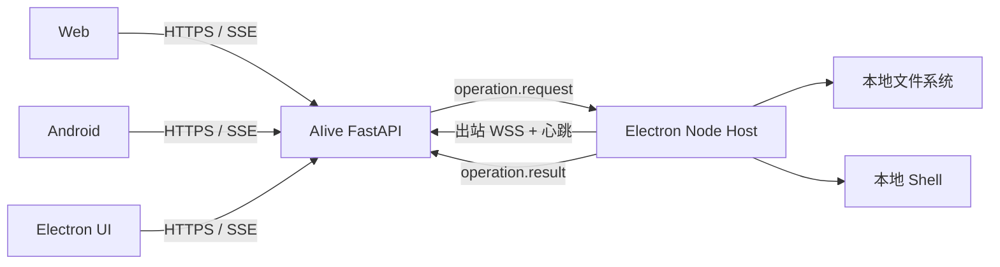

# Desktop 应用与本地执行节点指南

## 最终形态



三个 UI 使用同一聊天主链。Desktop Node 在线时，后端为当前 Turn 的工具注册表
叠加本机能力；节点离线或租约过期后，这些工具不再注入，Web 和手机端无法误调用
一个已经消失的桌面执行器。

## 构建和启动

要求 Node.js、npm、Python 3。Windows 安装包应在 Windows 构建机生成，macOS 和
Linux 同理。

```bash
./scripts/build-app.sh list
./scripts/build-app.sh desktop debug
./scripts/build-app.sh desktop release
```

- `debug` 调用 Electron Forge `package`，产物复制到 `artifacts/apps/desktop/`。
- `release` 调用 Electron Forge `make`，生成当前宿主平台的安装/分发格式。
- 构建器会先从品牌源图生成 PNG、ICO 和 ICNS。
- 当前产物未做 Windows Authenticode 或 macOS notarization；正式分发需接入自己的
  证书。

运行时变量：

| 变量 | 默认值 | 用途 |
|---|---|---|
| `AIIVE_DESKTOP_BACKEND_URL` | `http://127.0.0.1:8000` | API 和 Desktop WSS 根地址 |
| `AIIVE_DESKTOP_WEB_URL` | `<backend>/aiive/` | Electron 窗口加载的 UI 地址 |
| `AIIVE_DESKTOP_NODE_NAME` | 应用名 | 节点显示名 |

首次启动会在 Electron `userData` 目录生成稳定 UUID。打包版本默认注册开机启动，
关闭窗口只隐藏到托盘，选择“退出”才会断开节点。

## 数据库迁移

部署新后端前执行：

```bash
alembic upgrade head
```

迁移新增 `desktop_nodes` 和 `thread_desktop_bindings`。节点每 15 秒心跳一次，默认
租约 45 秒；断线会立即标记离线。

## 节点选择与绑定

只有一台在线 Desktop Node 时，未绑定线程自动使用该节点。两台及以上在线时，
为了避免把指令发到错误电脑，必须显式绑定：

```bash
curl http://127.0.0.1:8000/api/desktop/nodes

curl -X POST http://127.0.0.1:8000/api/desktop/bind \
  -H 'Content-Type: application/json' \
  -d '{"thread_id":"THREAD_UUID","node_id":"NODE_UUID"}'
```

绑定是线程级持久化关系。绑定节点离线时不会自动漂移到另一台电脑。

## 本地能力

Node Host 当前声明以下能力：

- 系统信息、任意路径 `stat`、目录列表；
- 文本和二进制分段读取；
- 文本和 Base64 二进制原子写入，可带 `expected_sha256` 防止并发覆盖；
- 文本精确替换、递归建目录、复制、移动；
- 安全删除，支持 `trash` 和 `permanent`；
- 使用系统 Shell 运行命令，支持工作目录、超时和附加环境变量，stdout/stderr
  各限制为 1 MiB。

能力访问范围不是项目目录，而是运行 Electron 的系统用户可以访问的全部本地路径。
读取能力不会在纯 Web/Android 后端启动时出现。

## 审批与删除边界

- 读取和普通写入默认自动执行，匹配个人 Agent 的高权限使用方式。
- `desktop_fs_delete` 与 `desktop_exec` 每次都需要确认。审批卡片会显示服务端冻结的
  工具名和参数，客户端只提交 approval ID 与同意/拒绝，不能替换待执行参数。
- Web、Android 和 Electron UI 都能处理审批；最终工具结果会写入审批记录和 Turn
  事件。
- 删除默认移动到 `~/.aiive/trash`；`permanent` 才永久删除。
- 磁盘根、用户主目录及其父目录、Windows 系统/程序目录、macOS 系统目录、Linux
  的 `/boot`、`/proc`、`/sys`、`/dev`、`/etc`、`/usr`、`/bin`、`/sbin`、`/lib`、`/var` 均拒绝
  直接删除，关键目录的父级同样拒绝。
- Shell 入口还会拦截明显指向根目录或关键系统目录的删除命令。复杂脚本或解释器
  无法仅靠字符串策略做到完备审计，最终边界仍包括当前系统用户权限、Windows ACL、
  macOS SIP 等操作系统保护；需要更强隔离时应让 Desktop 使用独立非管理员账户。

## 协议和 API

- `WS /ws/desktop/{node_id}`：hello、heartbeat、operation.request/result。
- `GET /api/desktop/nodes`：查看租约和连接状态。
- `POST /api/desktop/bind`：绑定线程到节点。
- `POST /api/approval/respond`：批准或拒绝冻结的高危工具调用。

当前定位是单用户个人 Agent，因此未加入额外账号鉴权。若把后端直接暴露到公网，
应至少在反向代理层限制访问者，并使用 HTTPS/WSS，避免本地执行能力被非预期客户端
调用。
