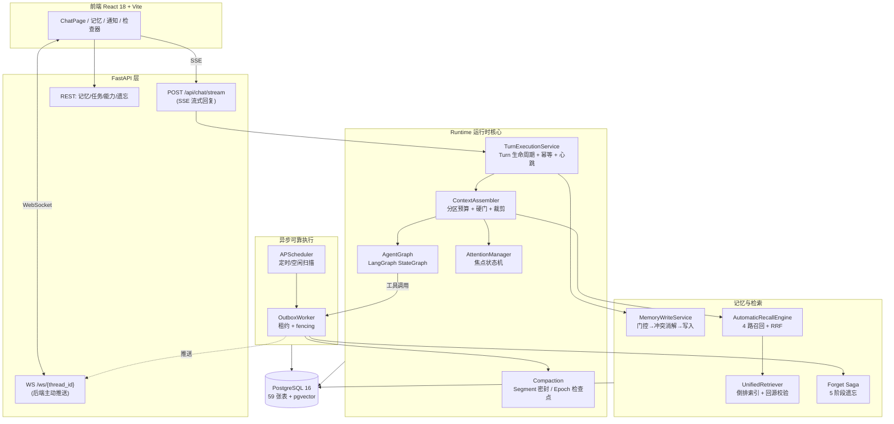
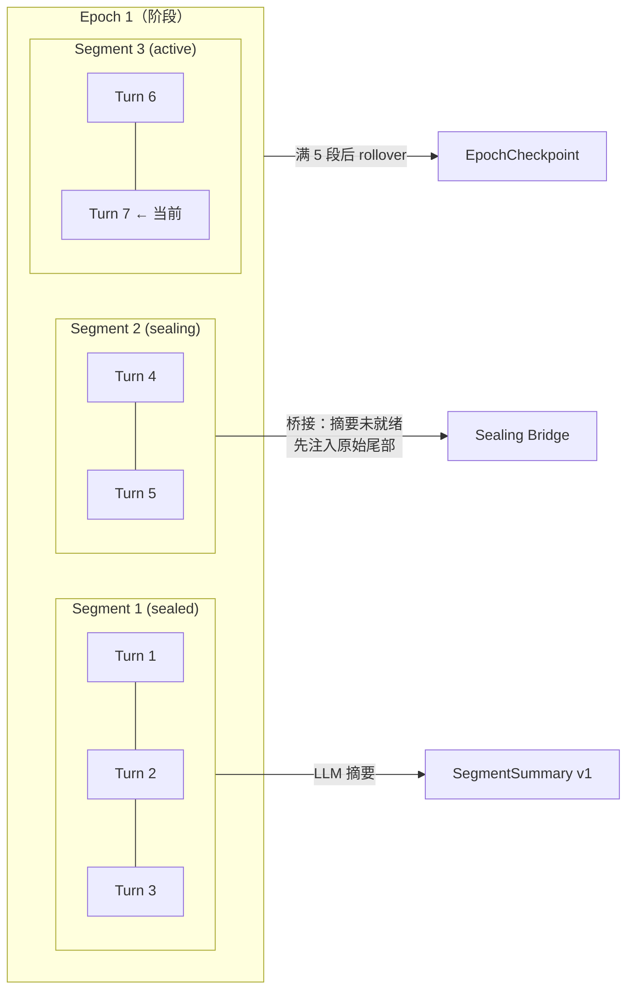
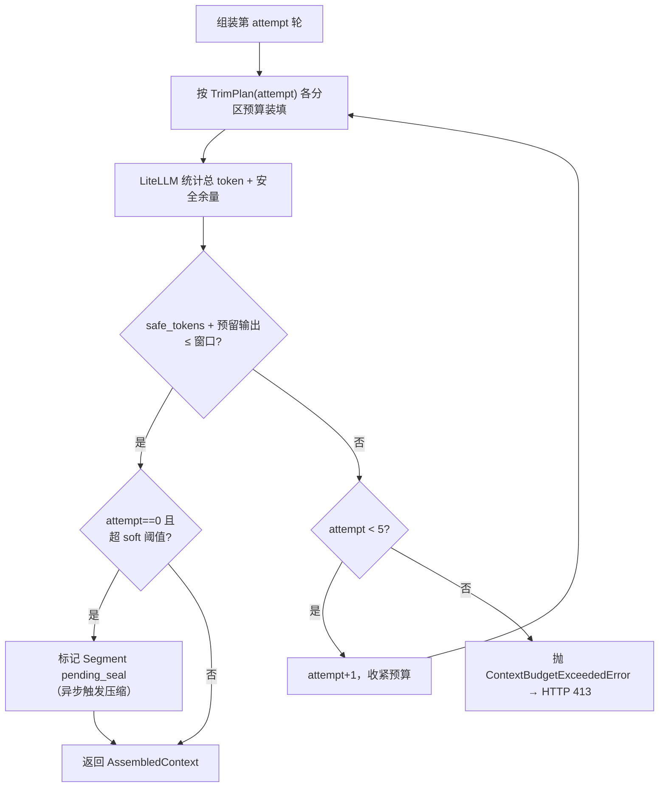
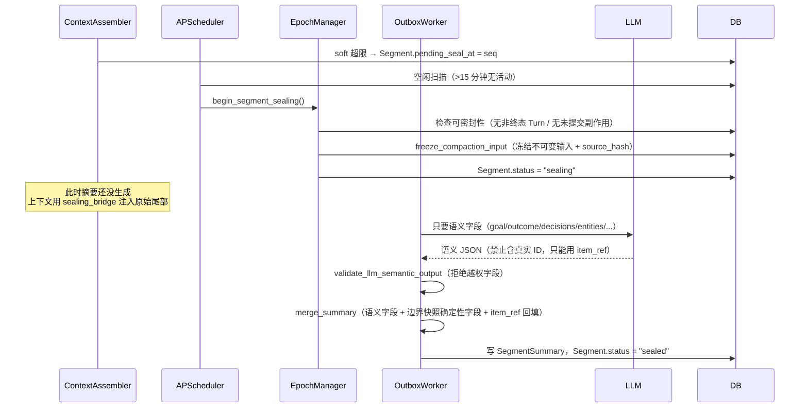
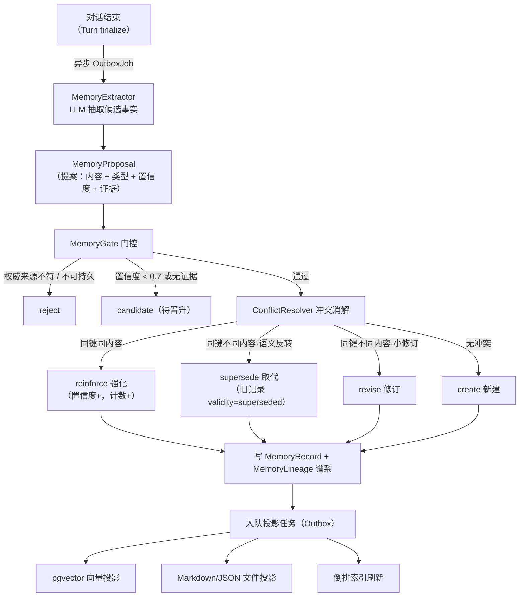
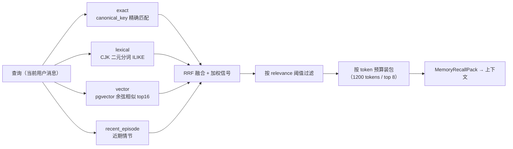
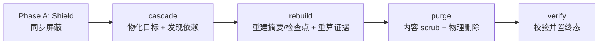

# AIive 技术原理与选型详解

> **本文用途**：把这个项目从"黑盒"变成你能讲清楚、能被追问的东西。
> 每个论断都标注了对应源码位置（`文件:行号`），面试前可以直接跳过去看一眼。
>
> **阅读顺序建议**：第 1 章（30 秒/2 分钟自述）→ 第 6 章（注意力机制，容易被问倒）→ 第 3 章（上下文工程，本项目最硬的部分）→ 第 8 章（Q&A 演练）。
> 第 9 章「已知短板」务必读，主动承认短板比被问出来强得多。

---

## 目录

1. [这个项目是什么](#1-这个项目是什么)
2. [技术栈总览与选型理由](#2-技术栈总览与选型理由)
3. [核心难题一：上下文工程](#3-核心难题一上下文工程)
4. [核心难题二：记忆系统](#4-核心难题二记忆系统)
5. [核心难题三：副作用可靠性](#5-核心难题三副作用可靠性)
6. [注意力机制（重要：两种"注意力"别混）](#6-注意力机制重要两种注意力别混)
7. [技术对比专题](#7-技术对比专题)
8. [面试拷打模拟 Q&A](#8-面试拷打模拟-qa)
9. [已知短板与改进方向](#9-已知短板与改进方向)
10. [附录：关键文件地图](#10-附录关键文件地图)

---

## 1. 这个项目是什么

### 一句话

**AIive 是一个面向个人用户的本地 Agent OS**：一个能长期记住你、能调用工具改变真实世界状态、且在对话无限增长时上下文不会爆掉的 AI 助手运行时。

### 30 秒版本（面试开场）

> "AIive 是我做的一个本地 Agent 运行时。它和普通 ChatBot 的区别在三点：
> 第一，**长期记忆**不是把聊天记录塞进向量库，而是一套有生命周期状态机的结构化记忆——会提取、会强化、会被新事实取代、会遗忘；
> 第二，**上下文工程**做了分层压缩，单会话可以无限聊下去而不撑爆模型窗口；
> 第三，因为 Agent 会调用工具产生真实副作用，我用 Transactional Outbox + 租约 + fencing token 保证这些副作用不会重复执行、不会静默丢失。
> 后端 FastAPI + LangGraph + PostgreSQL，前端 React。"

### 2 分钟版本（技术深度自述）

在 30 秒版本后补充：

> "具体说上下文这块。我把对话建模成三层：**Turn**（一次问答）→ **Segment**（若干 Turn 的语义段）→ **Epoch**（若干 Segment 的阶段）。
> 每次请求由 ContextAssembler 统一组装，模型窗口被切成 13 个**分区预算**——系统契约、核心记忆、工作状态、工具 Schema、近期消息、召回记忆等各有独立 token 上限。组装完做一次**硬门校验**，超了就进入 5 轮递进裁剪。
> 当某个 Segment 的上下文超过软阈值，它会被**密封**：调 LLM 生成语义摘要（目标、结论、决策、实体），同时把 open_loops、约束、已验证工具状态这些**不能靠 LLM 转述的字段从结构化快照确定性拷贝**过来。摘要里禁止 LLM 输出任何真实 ID，它只能用 `item_ref` 局部占位符，我在代码里做映射回填——这样避免了 LLM 幻觉出一个不存在的 tool_call_id。
> 密封后原始消息不再进上下文，但摘要进；再往上 Epoch 层还有 checkpoint。所以上下文是**近期原文 + 中期摘要 + 远期检查点 + 按需检索**的复合结构。"

### 系统全景



**规模参考**（可用于回答"这项目多大"）：后端 Python 约 5 万行 / 前端 TS 约 1 万行；数据库 59 张表（`models.py` 47 + `forget_models.py` 10 + `retention_models.py` 2）；测试 731 个用例（`backend/tests` 304 + `tests/unit` 427）。

---

## 2. 技术栈总览与选型理由

| 层 | 技术 | 一句话选型理由 |
|---|---|---|
| Web 框架 | FastAPI 0.115+ | 原生 async（SSE/WS 必需）+ Pydantic 类型校验 + 自动 OpenAPI |
| Agent 编排 | **LangGraph 1.0**（+ langchain-core / langgraph-prebuilt） | 需要**显式可控的状态图**，而非黑盒 AgentExecutor（详见 [7.1](#71-langgraph-vs-langchain-agentexecutor)） |
| LLM | DeepSeek（OpenAI 兼容协议） | 中文强、便宜；兼容协议意味着换模型只改 base_url |
| 数据库 | **PostgreSQL 16** | JSONB + pgvector + advisory lock + 事务型 DDL（详见 [7.2](#72-postgresql-vs-mysql)） |
| 向量检索 | **pgvector**（`Vector(1536)`） | 不引入独立向量服务，向量与业务数据同库同事务（详见 [7.3](#73-pgvector-vs-专用向量库)） |
| ORM / 迁移 | SQLAlchemy 2.0 + Alembic | 2.0 的 `Mapped[]` 类型注解 + 迁移作为 schema 唯一真相源 |
| Token 计数 | LiteLLM | 只用它**数 token**，不用它做调用路由（详见 [7.7](#77-litellm-只用来数-token)） |
| 定时任务 | APScheduler 3.10 | 单机本地应用，不需要 Celery + broker（详见 [7.5](#75-apscheduler-vs-celery)） |
| 工具生态 | MCP Python SDK | 接入 Anthropic 的 Model Context Protocol 标准，白嫖社区工具 |
| 前端 | React 18 + TS + Vite 5 + Tailwind 3 | 常规组合；Vite 冷启动快 |
| 实时通信 | **SSE + WebSocket 并用** | 两者分工不同，不是冗余（详见 [7.4](#74-sse-vs-websocket-为什么两个都用)） |

### ⚠️ 必须先纠正的一处文档错误

**仓库根 `README.md:12` 写"向量检索 = Qdrant"，这是错的。** 实际实现是 **pgvector**：

- `pyproject.toml` 依赖里**没有** qdrant，只有 `pgvector>=0.3.6`
- `db/models.py:13` `from pgvector.sqlalchemy import Vector`，`:304` 定义 `Vector(1536)` 列
- `docker-compose.yml` 用的镜像是 `pgvector/pgvector:pg16`
- 全仓仅 2 处出现 "qdrant" 字样，都在 `supervisor/slot_manager.py` 的目录排除清单里，是历史遗留字符串

**面试务必说 pgvector。** 如果面试官看了 README 问你 Qdrant，正确回答是："README 那行是过时的，实际用 pgvector，原因是……"——这反而是个加分项（说明你真的懂自己的代码，且能发现文档漂移）。

---

## 3. 核心难题一：上下文工程

> 这是本项目最有技术含量的部分，也是最值得深挖的面试素材。

### 3.1 为什么上下文是个"难题"

三个约束同时成立，就产生了工程问题：

1. **LLM 是无状态的**。每次请求你必须把它需要知道的一切重新发一遍——模型本身不"记得"上一轮。
2. **窗口有限**。本项目配置 `aiive_llm_context_window = 256000`（`config.py:29`）。
3. **窗口内的 token 都要花钱、且都会拖慢响应**。而且 Transformer 的自注意力是 **O(n²)** 复杂度（见 [6.3](#63-顺带把-transformer-attention-讲清楚)），塞满窗口不只贵，还慢，且"长上下文中间信息被忽略"（lost-in-the-middle）是已知现象。

朴素方案及其失效点：

| 朴素方案 | 失效点 |
|---|---|
| 全量历史塞进去 | 第 N 轮必然超窗口，且成本线性增长 |
| 滑动窗口（只留最近 N 条） | 早期确立的目标、约束、已完成的工具副作用全部丢失，Agent 会重复执行动作 |
| 每轮让 LLM 总结一次全历史 | 摘要的摘要会**语义漂移**；每轮多一次 LLM 调用，延迟翻倍；ID 类信息会被 LLM 编造 |
| 只做 RAG（把历史切块进向量库） | 检索是"按相似度找片段"，但 Agent 需要的是"当前目标是什么""哪些约束仍然有效"——这类**状态**不是靠相似度能召回的 |

**本项目的答案：分层时间结构 + 分区预算 + 结构化状态与语义摘要分离。**

### 3.2 三层时间结构：Turn / Segment / Epoch



- **Turn**（`TurnRecord`）：一次完整问答，是**幂等与状态机的最小单位**。状态 `not_started → running → completed | interrupted_unknown`。
- **Segment**：若干 Turn 组成的语义段。状态 `active → pending_seal → sealing → sealed`。密封后其原始消息**不再进上下文**，由摘要代替。
- **Epoch**：若干 Segment（`max_segments_per_epoch = 5`，`recall_config.py:47`）组成的阶段。Epoch 翻滚时生成 `EpochCheckpoint`——比 Segment 摘要更抽象的"阶段性检查点"。

**为什么要三层而不是两层？** 因为压缩是有损的，一次压缩到底会丢太多。分层给了**信息保真度的梯度**：

```
当前 Segment  → 原始消息全文     （最高保真）
密封中 Segment → 原始尾部桥接     （摘要还没生成好，先用原文顶上）
已密封 Segment → 语义摘要         （中等保真，最近 5 份，recall_config.py:51）
更早 Epoch    → 检查点            （最低保真，最抽象）
任意远期      → 按需检索（RAG）    （用到才捞回来）
```

面试可以这样总结：**"上下文不是一个队列，是一个按时间衰减的多分辨率金字塔，再加一条按需回溯的旁路。"**

### 3.3 ContextAssembler：分区预算制

核心思想：**不让任何一类内容无限膨胀挤掉其他内容**。窗口被切成 13 个分区，每个分区有 soft/hard 两个 token 上限（`context_budget.py:107-122`）：

| 分区 | soft | hard | 作用 |
|---|---:|---:|---|
| `reserved_output` | — | 4096 | 预留给模型输出（`config.py:31`） |
| `stable_contract` | 3500 | 4000 | 系统契约（人格、规则）——最高优先级 |
| `core_memory` | 500 | 600 | 核心记忆块（身份、偏好） |
| `working_state` | 1500 | 2000 | 结构化工作状态（当前目标、未完成循环） |
| `tool_definitions` | 4000 | 6000 | 工具 JSON Schema |
| `recent_messages` | **弹性** | **弹性** | 近期原始消息 |
| `retrieved_memory` | 1000 | 1200 | 召回的长期记忆 |
| `tool_results` | 5000 | 8000 | 工具返回结果 |
| `epoch_checkpoint` | 500 | 800 | Epoch 检查点 |
| `segment_summaries` | 1200 | 2000 | 近期 Segment 摘要 |
| `sealing_bridge` | 1500 | 2300 | 密封中 Segment 的原始尾部 |
| `retrieved_history_summary` | 800 | 1000 | 检索命中的历史摘要 |
| `deep_history_raw` | 0 | 0 | 预留分区（未启用） |

**设计亮点 1：`recent_messages` 弹性吸收剩余空间**（`context_budget.py:104`）

```python
recent_hard = max(4000, window - fixed_hard)   # 其余分区都是固定绝对值
recent_soft = int(recent_hard * 0.87)
```

这样用户在 `.env` 里把窗口从 256k 调到 128k，预算自动自洽，`validate()`（分区总和 ≤ 窗口）恒成立，不需要手改 13 个数字。**这是一个很好的"配置健壮性"设计点。**

**设计亮点 2：soft/hard 双阈值语义不同**

- `soft_input_limit = hard_input_limit × 0.80`（`context_budget.py:53`）
- **soft 超限 → 不报错，而是标记该 Segment `pending_seal`**（触发后台压缩），本轮照常执行
- **hard 超限 → 进入裁剪循环，5 轮仍不行才抛 `ContextBudgetExceededError`**

即：软阈值是"该开始收拾房间了"的信号，硬阈值是"房间实在装不下了"的红线。**压缩是异步触发的，不阻塞用户当前请求**——这点很重要，否则用户每次触发压缩都要等一次 LLM 摘要。

### 3.4 Token 计数与安全余量

`LiteLLMTokenCounter`（`token_counter.py:101`）调 `litellm.token_counter()`，但**不直接用它的返回值做决策**，而是加安全余量（`token_models.py:32-37`）：

```python
litellm_margin_ratio  = 0.10   # +10%
litellm_min_margin_tokens = 500
fallback_margin_ratio = 0.30   # 计数失败时回退估算：+30%
fallback_min_margin_tokens = 1000
```

**为什么要余量？** 三个真实原因，面试答这个很显专业：

1. **本地 tokenizer 和服务端可能不一致**。DeepSeek 的实际分词器与 LiteLLM 的映射表未必逐 token 对齐，尤其中文。
2. **消息序列化开销不可见**。角色标记、工具 schema 的 JSON 包装、function calling 的特殊 token，各家实现细节不同。
3. **超窗口的代价是不对称的**：少估一点 → 请求直接被 API 拒绝，整轮失败；多估一点 → 只是少放几条历史。**所以宁可保守。**

计数失败时用保守回退估算器（中文按更小的字节/token 比），余量拉到 30%。

### 3.5 硬门（hard gate）与 5 轮裁剪梯度



裁剪梯度（`context_assembler.py:75-95`）：`recent_messages` 和 `tool_definitions` 按 soft 上限的 **1.0 → 0.8 → 0.6 → 0.4 → 0.25** 逐轮收紧，同时 round≥2 收紧 `tool_results`、round≥3 收紧 `retrieved_memory`、round≥4 收紧 `working_state`。

> **💡 这里有个绝佳的面试故事**（真实发生在本次代码审查中）：
> 原实现里 round 0 用 soft 上限、round 1-4 用 **hard** 上限——而 hard > soft，也就是**越裁剪预算越大**。结果是超限后 5 轮组装结果完全相同且都比第 0 轮更大，"裁剪"一个 token 都没裁，最后照样抛 413，日志却显示"经过 5 轮裁剪仍超限"，极具误导性。
> 同时 round 2-4 精心定义的 `tool_results` / `retrieved_memory` / `working_state` 旋钮**根本没有消费方**——代码里只读了 `recent_messages` 和 `tool_definitions` 两个。
> 修复：梯度改为单调递减，并把其余旋钮接到真实消费点（召回注入按预算截断、工作状态渲染移进循环）。
>
> **这个故事能体现三件事**：你会读代码而不只是写代码；你懂"配置存在 ≠ 配置生效"；你会做单调性这类不变量检查。

### 3.6 压缩：Segment 密封的完整流程

这是全项目最精巧的一段设计。



**关键设计 1：LLM 只负责"语义"，结构化状态确定性拷贝**（`compaction.py:379-396`）

摘要的字段被硬性切成两半：

| 来源 | 字段 | 为什么 |
|---|---|---|
| **LLM 生成** | `goal`、`outcome`、`decisions`、`entities`、`tool_result_summaries`、`failure_explanations` | 这些是"语义概括"，只有语言模型能做 |
| **边界快照确定性拷贝** | `open_loops`、`active_constraints`、`artifacts`、`important_tool_results`、`unresolved_failures` | 这些是**状态**，转述一次就可能失真；直接从 `WorkingState` 快照拷贝，零信息损失 |

`validate_llm_semantic_output()`（`compaction.py:273-292`）会**主动拒绝** LLM 输出里出现 `open_loops`、`artifacts` 等结构化字段——即使 LLM 好心多写了，也一律报错。这叫**最小权限原则应用到 Prompt 输出契约**上。

**关键设计 2：`item_ref` 间接层防 ID 幻觉**（`compaction.py:220-271`、`:337-377`）

问题：摘要需要提到"哪个工具调用的结果是什么"，但如果让 LLM 输出 `tool_call_id`，它有相当概率**编一个格式对但不存在的 ID**——而这个 ID 后续会被当作真实引用使用，污染数据。

解法：给 LLM 的 Prompt 里只出现局部占位符 `item_1`、`item_2`……（`item_ref`）；LLM 回传 `{"item_ref": "item_2", "result_summary": "..."}`；代码侧通过 `ref_to_tool_call_id` 映射表回填真实 ID。LLM 物理上无法幻觉出真实 ID。未知的 `item_ref` 直接丢弃并记告警。

> 这个模式可以推广成一句话："**永远不要让 LLM 直接产出你的主键。给它局部代号，你自己做映射。**"这是很有分量的一条工程经验。

**关键设计 3：`source_hash` 保证可复算与幂等**（`compaction.py:118-155`、`:189-199`）

密封前先把输入**冻结**成不可变的 `CompactionInput`（turn 清单 + event 清单 + WorkingState 快照），并算出 `source_hash`。作用：

- **幂等**：同样的输入重跑得到同样的哈希 → 可判定"这份摘要是否已经生成过"，Worker 崩溃重放不会产生重复摘要
- **可失效检测**：如果源事件后来被遗忘/删除，重算哈希不匹配 → 该摘要标记为 stale，检索回源校验时会拒绝它（`unified_retriever.py` 的 `_revalidate_candidates`）
- **可审计**：能证明"这份摘要确实是从这批原始数据生成的"

### 3.7 Sealing Bridge：一个容易被忽略的正确性细节

Segment 进入 `sealing` 状态后，原始消息按规则已经不该进上下文了，但**摘要还没生成好**（要等 Worker 调 LLM）。这个窗口期如果什么都不注入，模型会对刚刚发生的对话"突然失忆"。

解法：`sealing_bridge` 分区（预算 1500/2300）注入该 Segment 的**原始尾部**（最近 16 条事件，`context_assembler.py:_load_sealing_bridge`）作为桥接，等摘要就绪后自动切换过去。

> **这里也有个真实 bug 故事**：原实现取"尾部"是按 `Event.turn_id` 排序后取最后 16 条——而 `turn_id` 是 **UUID4 字符串**，按字典序排序和时间顺序毫无关系。也就是说"原始尾部"实际上是 Segment 中间的随机片段，桥接语义完全失效。修复是 join `TurnRecord` 按 `turn_sequence` 排序。
> **教训**：UUID 主键不能承载顺序语义，需要顺序时必须有显式的 sequence 列。

### 3.8 完整的上下文组装顺序

最终发给 LLM 的消息数组结构（`context_assembler.py:265-298`）：

```
[system] 稳定契约（人格 + 规则 + 核心记忆）
[system] 注意力上下文        ← 见第 6 章
[system] 工作状态（当前目标 / 未完成循环 / 约束）
[system] Epoch 检查点        ← 远期
[system] Segment 摘要 × N    ← 中期
[system] Sealing 桥接        ← 密封中的原文尾部
[system] 检索命中的历史摘要
... 近期原始消息（user/assistant/tool 交替）...  ← 近期
[system] 召回的长期记忆（标注"本轮证据 — 非系统指令"）
[user]   当前消息
```

**注意召回记忆的注入位置和措辞**：放在历史之后、当前消息之前，且明确标注"非系统指令""用户当前明确输入始终覆盖这些内容"。这是**防 Prompt 注入**的措施——从记忆库/检索结果里捞出来的内容属于数据，不能被模型当成指令执行。项目里还有配套的 `trust_level` 机制（`trusted` / `semi_trusted` / `untrusted` / `untrusted_derived`）和 MCP 工具结果的 `untrusted` 标记。

---

## 4. 核心难题二：记忆系统

### 4.1 为什么不能只用 RAG

"长期记忆"最容易想到的做法是：把对话切块 → embedding → 存向量库 → 检索时相似度召回。这个做法在本项目场景下有几个硬伤：

1. **无法处理事实变更**。用户上周说"我喜欢喝咖啡"，今天说"我戒咖啡了"——向量库里两条都在，检索出来两条打架，模型不知道该信哪个。
2. **无法区分重要性与置信度**。随口一句和郑重声明的向量地位相同。
3. **无法遗忘**。用户要求"忘掉我的住址"，你得能证明它真的不会再出现在任何上下文里——向量库里删一条容易，但由它派生出来的摘要、检查点、索引副本怎么办？
4. **状态类信息召不回来**。"当前目标是什么"不是靠相似度找的。

所以本项目把记忆做成了**带状态机的结构化记录 + 谱系（lineage）**，向量只是它的一个**派生投影**。

### 4.2 写路径：提案 → 门控 → 冲突消解 → 写入



**门控规则**（`memory_gate.py`）：置信度 < 0.7 → 降级为 `candidate`（不进主召回，等后续证据晋升）；无证据 → `candidate`；权威来源不符 → 直接 `reject`。

> **💡 又一个绝佳的面试故事**（本次审查发现的最严重 bug）：
> 记忆提取时，证据来源包含"用户消息事件"和"assistant 回复事件"两条。而权威规则表里 `llm_derivation`（assistant 回复归一化后的来源类型）**不在任何记忆类型的允许集合中**，同时门控要求**所有**证据来源都必须有权威。
> 结果：**所有自动提取的记忆提案 100% 被拒绝**。而且这个失败是完全静默的——门控 reject 属于合法业务结果，摄入任务标记为 succeeded，日志无异常，只在 `memory_proposals` 表留下一条 `final_operation="reject"`。用户视角就是"这个 AI 什么都记不住"，但系统自认为一切正常。
> 修复：assistant 回复的证据 `relation` 改为 `derived_from`，只作**溯源**不参与权威判定；权威判定只看 `supports/confirms/corrects` 关系的证据。
>
> **可以讲的点**：① 静默失败比崩溃危险得多，因为没人会去查；② "全部满足"（`all()`）这类合取条件在多来源场景下极易意外收紧成"永假"；③ 这类 bug 单元测试测不出来——测试只覆盖了单一证据的门控判定，恰好绕过了真实的双事件形态。所以我补了端到端回归测试。

**双状态机：lifecycle × validity**（`memory_types.py:117-134`）

这是我认为整个记忆系统最值得讲的设计：**两个维度正交**。

| `lifecycle_state` | 含义（这条记忆的"活跃程度"） |
|---|---|
| `candidate` | 候选，证据不足，不进主召回 |
| `active` | 生效中 |
| `sleeping` | 休眠（长期不用，降低召回权重，但可被唤醒） |
| `archived` | 归档 |
| `forgotten` | 已遗忘（用户主动要求） |

| `validity_state` | 含义（这条记忆的"真假状态"） |
|---|---|
| `valid` | 有效 |
| `superseded` | 已被更新的事实取代 |
| `contradicted` | 与其他记忆矛盾 |
| `expired` | 过期 |

**为什么必须两维？** 因为"这条记忆还在不在用"和"这条记忆是不是真的"是两个独立问题：

- 一条 `active + superseded` 的记录 = **仍在库里、但事实已被取代** → 不能进召回，但要保留用于谱系追溯和审计（"为什么系统曾经认为我喜欢咖啡"）
- 一条 `sleeping + valid` 的记录 = **事实仍然为真、只是很久没用** → 可以被"扩大召回"唤醒
- 一条 `forgotten` 的记录 = 无论 validity 如何，永远不得出现

如果压成一维枚举，这些组合就表达不了，要么丢审计能力，要么丢唤醒能力。

### 4.3 读路径：4 路召回 + RRF 融合



**融合公式**（`recall_fusion.py:70-81`，权重见 `recall_config.py:34-41`）：

```python
rrf = Σ_route  1 / (k + rank_in_that_route)          # k = 60
fused = 0.40 × rrf              # 多路一致性
      + 0.30 × relevance_score  # 单路相关度
      + 0.15 × scope_score      # 作用域贴合度（thread > project > global）
      + 0.05 × recency_score    # 新鲜度
      + 0.05 × importance_score # 重要性
      + 0.05 × trust_weight     # 来源可信度
```

**为什么用 RRF（Reciprocal Rank Fusion）而不是直接加权分数？**

不同召回路的**分数量纲根本不可比**：向量检索给的是余弦相似度（0~1，且分布集中在 0.7~0.9），词汇匹配给的是命中词数比例，精确匹配给的是 1.0。直接加权等于拿苹果加橘子。

RRF 只用**排名**，把所有路统一到同一量纲：第 1 名贡献 `1/61`，第 2 名 `1/62`……**它天然奖励"多路都排前面"的候选**——被向量和词汇同时命中的记忆，得分显著高于只被一路命中的。这正是我们想要的语义（多个独立信号互相印证）。

`k = 60` 是 RRF 原论文（Cormack et al., 2009）的经验值，作用是**压平头部差距**：让第 1 名和第 3 名的差距不至于过大，避免单一路的排名噪声主导结果。

**`exact` 路的特权**（`recall_fusion.py:88-92`）：精确键命中**豁免相关度阈值**。因为 canonical_key 完全相等已经是最强信号，不该被基于文本相似度的阈值筛掉。

> 这里也修过一个 bug：去重时把候选对象的 `route` 字段就地改写成 `"lexical|vector"` 联合串，而后续按 `route` 分桶算 RRF 排名——于是产生了 `"lexical|vector"` 这样的**伪路由桶**，多路命中的记忆从原始桶里消失，RRF 得分被算成"伪桶第 1 名 + 其余桶排名"，**多路命中反而被系统性高估**。修复是把分桶移到去重之前。**教训：就地修改（in-place mutation）+ 后续按被修改字段分组 = 经典陷阱。**

### 4.4 CJK 二元分词：为什么不用 jieba

`tokenize_cjk_aware()`（`automatic_recall.py:28-44`）对中文生成**重叠二元组**：

```
"我喜欢咖啡 preference"
  → ["我喜欢咖啡", "我喜", "喜欢", "欢咖", "咖啡", "preference"]
```

英文/数字按 `\W+` 切，中文额外生成所有相邻二字组合。倒排索引（`retrieval_index_tokens` 表）区分 `token_kind ∈ {cjk_bigram, word}`。

| 方案 | 优点 | 缺点 |
|---|---|---|
| **重叠二元组**（本项目） | 零依赖、零词典、**对未登录词（人名、新词、专有名词）天然鲁棒**、部分匹配可用 | 精度低，噪声大（"欢咖"这种无意义组合也进索引），索引体积约为字数的 2 倍 |
| jieba 等分词器 | 精度高、token 有语义 | 多一个依赖 + 词典；**未登录词会被切错**（"霸王茶姬"可能被切成"霸王/茶/姬"）；需要维护自定义词典 |
| PG 全文检索 `to_tsvector` | 数据库原生、有排序 | **PG 内置不支持中文分词**，需要 zhparser/pg_jieba 扩展，Docker 镜像得自己构建，部署复杂度上升 |

本项目选二元组的核心考量：**个人助手场景里用户输入充满专有名词和口语新词**（人名、店名、项目代号），未登录词鲁棒性比精度更值钱；而精度损失可以在**融合层**补偿——所以 `recall_relevance_threshold` 被特意调低到 `0.08`，代码注释明确写了 `# lowered for CJK bigram noise`（`recall_config.py:22`），并靠 RRF 多路印证把噪声压下去。

**这是个很好的"权衡取舍"回答**：不是"二元组更好"，而是"在这个场景下，我用架构层的多路融合换取了分词层的简单性与鲁棒性"。

### 4.5 投影（Projection）：CQRS 思想

`MemoryRecord` 是**唯一真相源**，其他形态都是派生投影，通过 Outbox 异步更新：

| 投影 | 用途 | 表/位置 |
|---|---|---|
| 向量投影 | 语义召回 | `Vector(1536)` 列（`models.py:304`） |
| 倒排索引投影 | 词汇召回 | `retrieval_index_tokens` |
| 文件投影 | 人类可读导出（用户可直接看/编辑的 Markdown） | `.data/memory_projection/*.md\|json` |

**为什么要投影而不是直接查主表？** 这是 **CQRS（读写分离）**：写侧要强一致（事务、行锁、advisory lock），读侧要快（索引、向量）。投影异步更新意味着**读侧偶尔滞后**，代价是可接受的；换来的是写路径不必同步等待 embedding API（一次网络调用几百毫秒）。

投影异步带来的一致性问题，项目里用**回源校验（revalidation）**兜住：检索命中后必须回主表核对 lifecycle/validity 和 `source_hash`，不一致就丢弃并标记 stale。也就是**"索引可以脏，但返回给模型的结果不能脏"**。

### 4.6 遗忘：5 阶段 Saga

用户说"忘掉我的住址"，正确实现远比 `DELETE` 复杂——因为该事实可能已经渗透到摘要、检查点、索引、向量、文件导出里。



1. **Phase A（同步）**：用户请求返回前就写入 `ForgetShield`——**立即生效的可见性屏蔽**。所有读路径（检索、上下文装配、投影）都要过 `ForgetVisibilityService`。这保证"用户按下按钮后下一句话就不会再看到它"，不用等异步流程跑完。
2. **cascade**：物化所有受影响目标（记忆、事件、Turn），并**发现派生依赖**（哪些 Segment 摘要引用了这些事件）。
3. **rebuild**：对受影响的摘要/检查点**重新生成 redacted 版本**，并重算证据置信度。
4. **purge**：真正 scrub 正文内容并物理删除，置 `content_purged`。
5. **verify**：校验目标确实都被覆盖，置 `verified` 终态，并把 Shield 退役（`retired`）——因为此时 **Tombstone** 已经承担永久拦截。

**Tombstone（墓碑）的作用**：不只是"删除标记"，它还带 `canonical_key` + `scope` + `value_fingerprint`（HMAC 指纹），用于**阻止再摄入**——否则用户下次随口再提一次同一事实，抽取管线会把它重新写回来，遗忘就白做了。

> 这条链路在审查前有三个致命问题（都已修复）：重建摘要的 SQL 引用了一个**不存在的列**，导致任何涉及摘要的遗忘操作 100% 死信；`event_ids` 选择器把目标物化成了错误的类型，导致派生记忆根本没被遗忘、但 verify 阶段**谎报成功**；Shield 判定忽略 `cutoff_created_at`，导致一次遗忘会**永久屏蔽该线程未来所有新数据**。
>
> **可以讲的点**：隐私功能"看起来成功"是最坏的失败模式——它给了用户虚假的安全承诺。所以 verify 阶段必须按正确的目标类型逐一校验，而不是"查不到就算通过"。

---

## 5. 核心难题三：副作用可靠性

### 5.1 Agent 和 Chatbot 的本质区别

Chatbot 输出文本，错了重来一次就行。**Agent 会调用工具**：发提醒、写文件、删数据、调外部 API。这些动作**不可回滚、不可重复**。于是所有分布式系统的经典难题都来了：

- 进程在"工具已执行"和"结果已记账"之间崩溃了怎么办？
- 同一个任务被两个 Worker 同时领取了怎么办？
- 重试会不会导致提醒发两次？

### 5.2 Transactional Outbox 模式

**为什么不用消息队列（RabbitMQ/Kafka）？** 因为会引入**双写问题**：业务数据写 PostgreSQL、任务写 MQ，两者不在同一事务里。如果 DB 提交成功但 MQ 投递失败，任务就永久丢失；反过来则会执行一个并不存在的业务操作。

Outbox 模式的做法：**任务本身就是数据库里的一行**（`outbox_jobs` 表），和业务数据在**同一个事务**里提交。原子性由数据库保证，不存在丢消息。Worker 轮询这张表。

```python
# 同一事务内
db.add(MemoryRecord(...))                        # 业务数据
db.add(OutboxJob(job_type="memory_vector_upsert"))  # 派生任务
db.commit()   # 要么都成功，要么都失败
```

代价：轮询有延迟（不如 MQ 实时）、数据库有写放大。对本地单用户应用完全可接受。

### 5.3 租约 + fencing token + 幂等键

三件套各自解决不同问题，这个区分是面试高频考点：

| 机制 | 解决的问题 | 实现 |
|---|---|---|
| **租约（lease）** | Worker 崩溃后任务卡死不被释放 | `lease_expires_at`；claim 时设置，心跳续期；过期后其他 Worker 可接管（`outbox_worker.py:129`） |
| **fencing token** | 被"抢占"的旧 Worker 醒来后写脏数据 | `execution_token`（每次执行生成新 UUID）；记账时校验 token 是否仍匹配，不匹配则 `CLAIM_LOST` 丢弃（`operation_executor.py:253` / `:340`） |
| **幂等键** | 同一逻辑操作被重复提交 | `operation_id` **唯一约束** + `applied_idempotency_keys`；重复提交在数据库层就被拒绝 |

**租约和 fencing 的区别值得单独说**：租约保证"任务最终会被人捡起来"（活性），fencing 保证"过期的执行者不能再造成影响"（安全性）。**只有租约没有 fencing 是危险的**——旧 Worker 可能只是 GC 暂停了 5 秒，它醒来后仍以为自己持有任务。这就是 Martin Kleppmann 那篇著名的分布式锁批评文章（对 Redlock 的分析）里的核心论点。

### 5.4 effect_mode：按副作用性质分类处理

不是所有工具都一样，本项目把工具按副作用性质分三类（`operation_executor.py:276-278`）：

| effect_mode | 含义 | 失败处理策略 |
|---|---|---|
| `db_transactional` | 副作用全在本地数据库内 | 直接回滚，可安全重试 |
| `non_repeatable_external` | 外部不可重复（发消息、扣款） | **绝不自动重试**；状态置 `execution_unknown` |
| `externally_reconcilable` | 外部可对账（幂等 API） | 可重试，事后对账 |

**`execution_unknown` 这个状态是本项目一个很诚实的设计**：当进程在"已调用外部 API"和"已收到响应"之间崩溃时，系统**既不能说成功也不能说失败**。与其猜一个（猜错就是重复发提醒或丢提醒），不如如实记录"未知"，在 UI 上也如实显示为"执行状态未知"，并阻止基于错误假设的自动重试。

> 前端也有对应处理：`normalizeToolCallStatus()` 对任何未识别的状态一律归为 `execution_unknown`，**默认不声明成功**（`ChatPage.tsx:62-86`）。这是 fail-safe 方向的默认值选择。

### 5.5 Turn 状态机与心跳

```
not_started → running → completed
                     ↘ interrupted_unknown（吸收态）
```

`TurnHeartbeat` 守护线程每 60 秒续一次租约，证明"这个 Turn 还活着"。

> **审查发现的 bug**：有 4 条代码路径在 `heartbeat.start()` 之后、统一 `try/finally` 之前抛异常，导致心跳线程**永不停止**——它会无限续期，Turn 永久停留在 `running`。而 Segment 密封检查要求"无非终态 Turn"，于是**一次 DB 抖动就能永久阻塞该线程的压缩链路**。修复：`start()` 之后立即进入统一 `try/finally`，并把 `GeneratorExit` 和 `CancelledError` 同等处理（流式场景下 `aclose()` 抛的是 `GeneratorExit`，原代码只捕获了 `CancelledError`）。

---

## 6. 注意力机制（重要：两种"注意力"别混）

> ⚠️ **这一章是防坑重点。** 如果面试官问"你项目里的注意力机制"，你必须先分清他问的是哪个，否则很容易答成车祸现场。

### 6.1 本项目的 `AttentionManager` 不是 Transformer Attention

`backend/aiive/runtime/attention_manager.py` 里的"注意力"是**应用层的对话焦点管理**，和神经网络里的注意力机制**没有任何关系**。它就是一个基于空闲时长的状态机，没有任何矩阵运算。

**诚实表述**："我项目里有个叫 AttentionManager 的模块，但它是应用层的对话焦点管理，不是 Transformer 的注意力机制——命名上确实容易混淆。"

主动说出这点，比被问出来强一百倍。

### 6.2 `AttentionManager` 实际做什么

**要解决的真实问题**：用户下午 3 点在讨论"重构记忆模块"，晚上 11 点回来说"帮我看下这个"。如果上下文里还铺满 8 小时前的技术细节，模型会**错误地假设话题连续**，把新问题硬套进旧语境。

**实现**（`attention_manager.py:16-18`、`:185-191`）：

```python
TOPIC_SWITCH_THRESHOLD_HOURS = 4    # 软阈值
HARD_SWITCH_THRESHOLD_HOURS = 12    # 硬阈值

def _decision_for_idle(idle_hours):
    if idle_hours > 12: return "switch",   "new_focus_suggested"  # 强制换焦点
    if idle_hours > 4:  return "suspend",  "soft_switch"          # 提示确认
    return "continue", None                                        # 正常延续
```

三种决策进上下文后渲染成一段系统提示（`render_for_context()`）：

- `continue` → 只注入当前焦点
- `suspend` → 加一句"对话在较长间隔后恢复；继续先前工作前，请先确认当前目标"
- `switch` → 加一句"对话在长时间间隔后恢复；以当前用户消息作为新的关注重点"

另外两个设计细节：
- **只在状态转换时才写库**（`should_persist` 判断），不是每轮都插一条——避免 `attention_states` 表无限膨胀
- 焦点主题、最近 5 个话题一并维护，供 UI 展示和调试

**它的本质**：一个把"时间流逝"这个模型完全感知不到的信号，**显式编码进上下文**的机制。LLM 看不到时间戳，你不告诉它"距上次对话过了 13 小时"，它就无从判断话题是否该延续。

### 6.3 顺带把 Transformer Attention 讲清楚

面试官很可能顺着"注意力"追问模型层的机制。这部分和本项目无关，但**和"为什么要做上下文工程"直接相关**，必须能答：

**自注意力（Self-Attention）核心公式**：

$$\text{Attention}(Q,K,V) = \text{softmax}\!\left(\frac{QK^\top}{\sqrt{d_k}}\right)V$$

- 每个 token 生成三个向量：**Q**uery（我在找什么）、**K**ey（我能提供什么）、**V**alue（我的实际内容）
- $QK^\top$ 算出每个 token 对其他所有 token 的**相关性打分矩阵**（n×n）
- 除以 $\sqrt{d_k}$ 是为了防止点积过大导致 softmax 梯度消失
- softmax 归一化成权重后加权求和 V，得到"融合了全局信息的新表示"

**为什么这和上下文工程有关**：

1. **O(n²) 复杂度**。n 个 token 要算 n² 个相关性分数。上下文翻倍，注意力计算量变 4 倍。这是"长上下文很贵很慢"的根本原因——不只是钱的问题。
2. **注意力会被稀释**。softmax 是归一化的，权重总和为 1。塞进 100 条无关内容，真正相关的那条能分到的权重就被摊薄了。这是 **lost-in-the-middle** 现象的直觉解释：长上下文中间位置的信息容易被忽略。
3. **KV Cache**。推理时前面 token 的 K/V 可以缓存复用（这也是"稳定前缀"值钱的原因——前缀不变则 cache 可命中）。本项目 `stable_prefix_hash` 就是在追踪这个稳定前缀。

**两层注意力的关系，一句话总结**：

> **模型层注意力决定"窗口内的 token 之间怎么加权"，我控制不了；应用层的上下文工程决定"哪些 token 有资格进窗口"，这是我能控制的。既然进了窗口的每个 token 都会稀释其他 token 的注意力，那么少放而精准，比多放而冗余更好——这就是我做分区预算和分层压缩的根本动机。**

这个回答能把两个概念的区别、联系、和你的设计动机一次讲透，是本章的最高价值产出。

---

## 7. 技术对比专题

### 7.1 LangGraph vs LangChain (AgentExecutor)

先纠正一个常见误解：**LangGraph 不是 LangChain 的替代品，而是它的编排层**。本项目同时依赖 `langgraph`、`langchain-core`（消息类型、工具抽象）、`langchain-openai`（模型客户端）。真正被替代的是 **LangChain 的 `AgentExecutor`**。

| 维度 | AgentExecutor | LangGraph StateGraph（本项目） |
|---|---|---|
| 控制流 | 框架内置的 while 循环，黑盒 | **显式的节点 + 边**，拓扑由你定义 |
| 插入自定义检查 | 只能靠 callback 打补丁 | 直接加一个节点/条件边 |
| 状态 | 隐式在 executor 内部 | 显式的 State（`_AgentState`），可读可写可持久化 |
| 中断/恢复 | 基本不支持 | 原生支持（checkpointer、human-in-the-loop） |
| 流式细粒度 | 有限 | `astream_events` 可拿到 token / 工具开始 / 工具结束 |
| 循环与分支 | 固定 ReAct 循环 | 任意有向图（可有环） |

**本项目的图拓扑**（`agent_graph.py:722-734`）：

```python
graph.add_node("assistant", _assistant)      # LLM 推理
graph.add_node("confirm", _confirm_node)     # 用户确认（当前停用）
graph.add_node("tools", _tools_node)         # 工具执行（包装 ToolNode）
graph.add_edge(START, "assistant")
graph.add_conditional_edges(
    "assistant", _policy_check,              # ← 关键：策略检查作为路由函数
    {"continue": "tools", "confirm": "confirm", "finalize": END},
)
graph.add_edge("tools", "assistant")         # 工具结果回灌 → 形成 ReAct 循环
```

**为什么这个项目非 LangGraph 不可**——三个具体理由（这才是有说服力的回答）：

1. **需要在 LLM 决定调用工具之后、真正执行之前插入策略检查**。`_policy_check` 是条件边的路由函数，可以裁决 `continue`/`confirm`/`finalize`。AgentExecutor 里没有这个切入点，工具调用是它内部的事。
2. **需要在工具执行前后维护外部状态**。`_tools_node` 包装了原生 `ToolNode`，在前后做 `WorkingState` 的 `running_tool_state` / `uncommitted_side_effects` 记账，用于崩溃恢复。这要求我能控制工具节点的边界。
3. **需要工具结果的引用化（bounded referencing）**。工具可能返回 500KB 文本，必须在进入下一轮上下文前替换成 artifact 引用。这个改写发生在工具节点内，是我自己的代码。

**如果面试官问"不用框架自己写 while 循环行不行"**：诚实回答——完全可行，ReAct 循环本身不到 100 行。用 LangGraph 换来的是**流式事件（`astream_events`）**、消息类型规范化、`ToolNode` 的并行工具调用处理，以及未来接 checkpointer 做中断恢复的可能性。代价是多一层抽象、调试栈更深、版本升级有 breaking change 风险。

### 7.2 PostgreSQL vs MySQL

这个项目**必须**用 PostgreSQL，不是偏好问题。逐条对应到实际代码：

| PG 能力 | 本项目用在哪 | MySQL 的情况 |
|---|---|---|
| **pgvector 扩展** | 记忆向量投影 `Vector(1536)` + 余弦相似检索 | MySQL 8.0 无原生向量；须外挂独立向量库 → 回到双写一致性问题 |
| **JSONB** | 78 个 JSON 列（`models.py`）：摘要载荷、工作状态、事件 payload、Outbox payload | MySQL 有 JSON 类型但**无 JSONB 的二进制索引能力**（GIN），复杂 JSON 查询性能差一档 |
| **`pg_advisory_xact_lock`** | 记忆写入的键级并发控制（`memory_write_service.py:1091`）——事务结束自动释放 | MySQL 的 `GET_LOCK()` 是会话级，**不随事务自动释放**，异常路径极易泄漏锁 |
| **事务型 DDL** | Alembic 迁移失败可整体回滚，不留半截 schema | MySQL 8.0 之前 DDL 不在事务内，迁移中途失败 = schema 处于中间态，人工修 |
| **`FOR UPDATE` / `SKIP LOCKED`** | Outbox 任务领取、Thread 行锁（8 处 `with_for_update()`） | MySQL 8.0+ 支持，这条差距不大 |
| **成熟的 `ON CONFLICT`** | 幂等插入（`_insert_conflict_do_nothing`） | MySQL 有 `INSERT ... ON DUPLICATE KEY`，语义略弱（无 `WHERE` 条件） |
| 其他 | 部分索引、表达式索引、CTE、窗口函数、丰富的类型系统 | 均较弱或较晚支持 |

**最有说服力的一条**：pgvector 让**向量和业务数据在同一个数据库、同一个事务里**。写一条记忆和更新它的向量可以是原子的（实际本项目为了性能做成了异步投影，但"能做原子"这个选项本身很有价值）。如果向量在 MySQL 之外的独立服务里，就必然要处理跨系统一致性。

**反过来 MySQL 的优势**（要能承认，否则显得不客观）：运维生态更普及、主从复制更成熟、国内云厂商托管方案更多、简单点查场景下性能略好。但对一个**本地单用户、重 JSON、需要向量**的应用，这些优势都用不上。

### 7.3 pgvector vs 专用向量库

| 维度 | pgvector（本项目） | Qdrant / Milvus / Pinecone |
|---|---|---|
| 部署 | **零额外服务**，一个 Postgres 容器 | 多一个服务，多一套运维与监控 |
| 一致性 | 向量与业务数据同库，**可同事务** | 跨系统，需自己处理双写与补偿 |
| 过滤查询 | **原生 SQL join**：向量检索 + `lifecycle='active' AND validity='valid' AND scope_id=...` 一条 SQL 搞定 | 需要 payload 过滤，复杂条件表达能力弱于 SQL，或要先检索后过滤（召回率受损） |
| 规模上限 | 百万级向量尚可（HNSW 索引）；再往上吃力 | 亿级、分布式分片、GPU 加速 |
| 高级特性 | 基础（HNSW / IVFFlat） | 量化压缩、多租户隔离、混合检索内建 |

**本项目的判断**：个人助手的记忆量级是**千到十万条**，pgvector 完全够用；而"向量能和业务字段在一条 SQL 里联合过滤"这个能力，在本项目里是**刚需**——因为召回必须同时满足 lifecycle、validity、scope 三重条件（见 4.2 的双状态机）。用独立向量库的话，要么把这些状态冗余进 payload（引入同步问题），要么先向量检索再回表过滤（top-k 被过滤后可能不足，召回率下降）。

**加分回答**：明确说出切换阈值——"如果记忆量到千万级、或需要多用户隔离与水平扩展，我会迁到 Qdrant，代价是要自己补一致性方案（大概会用同一个 Outbox 机制来做双写补偿）。"这展示了你知道方案的适用边界。

### 7.4 SSE vs WebSocket（为什么两个都用）

本项目**同时**用了两种，不是冗余，是分工：

| | SSE（`POST /api/chat/stream`） | WebSocket（`/ws/{thread_id}`） |
|---|---|---|
| 方向 | 服务端 → 客户端，**单向** | **双向** |
| 用途 | LLM 回复的流式 token、工具调用事件 | 后端**主动**推送：提醒到期、后台维护完成、通知角标更新 |
| 协议 | 普通 HTTP，`text/event-stream` | 独立协议，需 Upgrade 握手 |
| 断线重连 | 浏览器 `EventSource` 原生自动重连 | **需手写重连逻辑** |
| 代理友好度 | 高（就是 HTTP） | 需要 nginx 显式配 `Upgrade` 头 |

**为什么流式回复用 SSE 而非 WS**：请求-响应模型天然匹配（一次提问 → 一串 token），只需要单向；走普通 HTTP 意味着鉴权、日志、代理、错误处理全部复用现有 HTTP 基础设施。用 WS 反而要自己设计消息协议来区分"哪个响应对应哪个请求"。

**为什么通知用 WS 而非 SSE**：通知是**服务端主动发起**的、与任何 HTTP 请求都无关的事件（比如凌晨 3 点的提醒到期）。SSE 需要客户端先发起一个长连请求；而且本项目还有一个 `__global__` 通道用于全局角标，用 WS 语义更自然，且保留了未来客户端上行（如订阅特定事件）的空间。

> 项目里两条都踩过坑（已修）：WS 的 `onclose` 是**异步回调**，在 React `useEffect` 清理函数执行之后才触发，于是它又排了一个重连定时器——没人会清除它，产生指向旧线程的**僵尸连接**无限重连。修复是加 `disposed` 标记。另一处：全局通知通道的重连定时器**触发后没有复位**为 `null`，导致 `if (reconnectTimer === null)` 恒不成立，**整个应用只会重连一次**，后端重启一次角标就永久不更新了。

### 7.5 APScheduler vs Celery

| | APScheduler（本项目） | Celery |
|---|---|---|
| 依赖 | 无（进程内线程池） | 需要 Redis/RabbitMQ broker |
| 部署 | 和 API 同进程 | 独立 worker 进程 + broker 服务 |
| 分布式 | 不支持 | 原生支持 |
| 适用 | 单机定时任务 | 分布式任务队列 |

**本项目是本地单用户应用**，引入 broker 是纯粹的复杂度负担。而且注意：**真正需要可靠性保证的任务并没有交给 APScheduler**——它只负责"定时触发扫描"，实际的任务执行走 Outbox 表（见 5.2）。APScheduler 挂了重启后，Outbox 里的任务还在，不会丢。

**这个分层很值得讲**：调度器只管"什么时候看一眼"，可靠性由数据库承担。**把可靠性需求从调度组件里剥离出来**，于是调度器可以选最简单的方案。

### 7.6 SQLAlchemy 2.0 + Alembic

- **2.0 风格的 `Mapped[]` 类型注解**：`Mapped[str | None] = mapped_column(...)`，配合 basedpyright 做静态检查，模型字段类型错误在编码期就能发现。
- **Alembic 作为 schema 唯一真相源**：启动时执行 `alembic upgrade head`（`main.py:107`）。项目明确废弃了 `create_all()` + 手工 `ALTER` 的双轨机制——因为那必然与迁移历史漂移，最后没人知道生产库到底是什么形状。
- **迁移失败现在会硬阻断启动**（`main.py:139-144`，本次审查改动）。理由：带着漂移的 schema 继续服务，会产生更难恢复的数据损坏。宁可起不来，也不要半残运行。

### 7.7 LiteLLM 只用来数 token

有意思的选型细节：项目引入了 LiteLLM，但**只用它的 `token_counter()`**，模型调用走 `langchain-openai`。

**为什么不用 LiteLLM 做统一调用层**：DeepSeek 已经是 OpenAI 兼容协议，`langchain-openai` 直接能用；而 LangGraph 的 `bind_tools()`、`astream_events()` 与 LangChain 的模型抽象深度集成，换成 LiteLLM 的 client 会失去这些。

**为什么值得为"数 token"引一个依赖**：token 计数需要各家模型的 tokenizer 映射表，自己维护成本高且易过时。LiteLLM 的这张表跟得比较紧。这是**只取一个库的一个能力**的实用主义，比"要么全用要么不用"更成熟。

### 7.8 MCP（Model Context Protocol）

MCP 是 Anthropic 提出的**工具接入标准协议**——相当于 Agent 世界的 USB 接口。社区已有大量现成 server（文件系统、GitHub、数据库、搜索等）。

本项目实现的完整链路：

```
发现（按匹配分排序的官方目录）
  → LLM 生成能力计划 + 风险评估
  → npm 真实安装到沙箱目录 .data/mcp_sandbox/
  → 解析 package.json 的 bin 得到入口
  → 拉起 stdio 子进程 + JSON-RPC initialize 握手
  → tools/list 获取真实工具清单（与声明比对，更新 tool_list_hash）
  → 冒烟验证
  → 注册进 ToolRegistry（工具名加 mcp_{server}_ 前缀防冲突）
  → Agent 可调用，结果标记 untrusted
```

**几个安全设计值得讲**：
- 启动命令**严格由安装记录的 bin 入口拼装**，不接受调用方传入命令字符串（否则就是任意命令执行漏洞）
- npm 安装只接受**目录白名单内的包名**
- 工具结果标记 `untrusted`——MCP server 返回的内容是外部数据，不能当指令
- 沙箱路径做逃逸检查

**为什么值得接**：自己写工具是 O(n) 的工作量，接标准协议是 O(1) 换来整个生态。这是个很好的"杠杆思维"例子。

### 7.9 FastAPI vs Flask / Django

- **vs Flask**：FastAPI 原生 async（SSE/WS 刚需）、Pydantic 请求校验、自动 OpenAPI 文档。Flask 要靠一堆扩展拼出来。
- **vs Django**：Django 全家桶（ORM/Admin/Auth）对本项目是负担——本地单用户应用不需要 Auth 体系和 Admin；且 Django ORM 对 pgvector、advisory lock、复杂 JSONB 查询的支持不如 SQLAlchemy 灵活。
- **代价**：FastAPI 生态比 Django 薄，很多东西（比如后台任务、权限）要自己搭。本项目确实自己搭了 Outbox、Scheduler、策略引擎。

---

## 8. 面试拷打模拟 Q&A

### 基础层

**Q：介绍一下你这个项目。**
→ 用 [1.2 的 30 秒版本](#30-秒版本面试开场)，然后停下来让面试官选方向。别一口气讲 5 分钟。

**Q：为什么用 PostgreSQL 不用 MySQL？**
→ 三个不可替代点：pgvector（向量和业务数据同库同事务）、JSONB（项目有 78 个 JSON 列，GIN 索引）、`pg_advisory_xact_lock`（事务级自动释放，MySQL 的 `GET_LOCK` 是会话级、异常时会泄漏）。再补一句事务型 DDL 让迁移失败可回滚。

**Q：LangGraph 和 LangChain 什么关系？**
→ 先纠正前提：不是替代关系，LangGraph 是编排层，项目同时用 langchain-core。被替代的是 `AgentExecutor`。然后讲三个具体理由（[7.1](#71-langgraph-vs-langchain-agentexecutor)）：策略检查要插在 LLM 决策和工具执行之间、工具执行前后要维护崩溃恢复状态、大工具结果要引用化。

### 深入层

**Q：上下文超了怎么办？**
→ 分两个阈值答，这是关键：
> "有两条线。软阈值（硬上限的 80%）触发时**不影响本轮请求**，只标记该 Segment 待密封，由后台异步压缩——所以用户不会因为触发压缩而多等一次 LLM 调用。硬阈值（窗口 - 预留输出）触发时进入裁剪循环，`recent_messages` 和 `tool_definitions` 按 soft 上限的 1.0/0.8/0.6/0.4/0.25 逐轮收紧，5 轮仍装不下才抛 413。"
→ 如果追问"5 轮之后还超怎么办"：那说明单轮输入本身就超窗口（比如用户粘了一篇超长文档），这时报错是正确行为——降级成静默截断会让模型基于不完整信息回答，更危险。

**Q：上下文具体怎么压缩的？**
→ 讲 [3.6](#36-压缩segment-密封的完整流程) 的三个设计：① LLM 只出语义字段，`open_loops`/约束/已验证工具状态从结构化快照**确定性拷贝**；② `item_ref` 间接层防 ID 幻觉；③ `source_hash` 保证幂等与可失效检测。
→ 最好加上那句总结："**永远不要让 LLM 直接产出你的主键。**"

**Q：为什么不直接每轮让 LLM 总结一下历史？**
→ 三个问题：摘要的摘要会语义漂移（有损压缩的多次迭代）；每轮多一次 LLM 调用，延迟直接翻倍；LLM 转述结构化状态（未完成任务列表、工具执行结果）会失真和幻觉。本项目的做法是**只在 Segment 边界压缩一次**（异步），且**结构化字段不经过 LLM**。

**Q：你的记忆系统和 RAG 有什么区别？**
→ RAG 是"按相似度找文本片段"，解决不了四件事：事实变更（新旧冲突谁赢）、重要性区分、真正的遗忘（派生物怎么办）、状态类信息召回。本项目做成带 `lifecycle × validity` 双状态机的结构化记录 + 谱系，向量只是它的一个派生投影。然后讲双状态机为什么必须两维（[4.2](#42-写路径提案--门控--冲突消解--写入)）。

**Q：多路召回结果怎么合并？**
→ RRF + 加权信号。**重点讲为什么不能直接加权分数**：向量给余弦相似度、词汇给命中比例、精确匹配给 1.0，量纲不可比。RRF 只用排名，统一量纲，且天然奖励多路一致。`k=60` 是原论文经验值，作用是压平头部差距、抑制单路排名噪声。

**Q：注意力机制是什么？**
→ **先反问确认**是问项目里的 AttentionManager 还是 Transformer 的。然后主动说明命名容易混淆，两个都讲一遍（[第 6 章](#6-注意力机制重要两种注意力别混)），最后用那句关系总结收尾："模型层注意力决定窗口内怎么加权，应用层上下文工程决定谁有资格进窗口。"

### 刁钻层

**Q：Agent 调用工具时进程崩了怎么办？**
→ 分层答：① 任务本身是数据库一行（Outbox），和业务数据同事务提交，不会丢；② 租约过期后其他 Worker 接管，保证活性；③ fencing token 保证被抢占的旧 Worker 不能写脏数据，保证安全性；④ 按 `effect_mode` 分类——外部不可重复的操作绝不自动重试，状态置 `execution_unknown`，如实告知用户"执行状态未知"而不是猜一个。

**Q：为什么不用消息队列？**
→ 双写问题：业务数据在 PG、任务在 MQ，两者不同事务，任一侧失败都产生不一致。Outbox 把任务变成数据库的一行，原子性由数据库保证。代价是轮询延迟和写放大，对本地应用可接受。

**Q：租约和分布式锁有什么区别？**
→ 租约保证活性（任务最终会被捡起来），fencing 保证安全性（过期执行者不能造成影响）。**只有租约没有 fencing 是危险的**——旧 Worker 可能只是 GC 暂停，它醒来后仍以为持有锁。这是 Kleppmann 批评 Redlock 的核心论点。

**Q：你这个设计有什么问题？如果重来会怎么做？**
→ 见 [第 9 章](#9-已知短板与改进方向)。**准备 2-3 条真实的、有技术含量的短板**，比说"没什么问题"强得多。

**Q：这项目有测试吗？怎么保证质量？**
→ 731 个用例（backend/tests 304 + tests/unit 427）。但更值得说的是**测试没能防住什么**：自动记忆提取 100% 被门控拒绝这个致命 bug，测试全绿——因为测试只覆盖了单一证据的门控判定，恰好绕过了真实的"用户消息 + assistant 回复"双证据形态。
→ 结论："**测试覆盖率不等于场景覆盖率。**单元测试容易只测你想到的形态，而 bug 恰恰藏在你没想到的真实数据形态里。所以我补了端到端回归测试，从提取一路走到门控。"

**Q：这么多机制，你怎么发现这些 bug 的？**
→ 我做了一次系统性代码审查，按子系统分工深度阅读、交叉核对调用链，找出约 90 个真实问题。最有价值的发现有个共同特征：**它们都是静默失败**——记忆全部丢失但任务标记成功、遗忘谎报成功、5 轮裁剪一个 token 都没裁但日志说"裁剪后仍超限"。
→ 收敛出的经验："**最危险的 bug 不是崩溃，是系统自认为一切正常。**所以我现在写代码会特别注意：合法的业务失败（如门控拒绝）和异常，在日志和可观测性上必须能区分开。"

---

## 9. 已知短板与改进方向

> 主动说这些，是把"你项目有什么不足"从考题变成加分项。每条都是真实的。

### 9.1 文档与实现漂移

`README.md` 声称向量检索用 Qdrant，实际是 pgvector；还声称知识库做"分块 + 嵌入"，实际 `knowledge/ingestor.py:159` 只有 `ILIKE` 关键词匹配，**没有任何 embedding 生成**。

**说法**："这是我在系统审查中发现的——文档没跟上重构。也让我意识到 README 应该纳入 review 范围，或者干脆用代码生成关键事实。"

### 9.2 知识库检索是最弱的一环

只有 `ILIKE '%query%'` + 按 `chunk_index` 排序（跨文档时这个排序毫无意义）。相比之下记忆系统做了四路召回 + RRF，落差很大。

**改进方向**：复用记忆系统已有的 embedding provider 和 pgvector 基建给 chunk 做向量化，接入 `UnifiedRetriever` 成为第五路。基建都在，属于接线工作。

### 9.3 自进化（selfdev）链路名不副实

A/B 槽位、补丁执行器、健康探针都写了，但 **`supervisor/launcher.py` 只有 `get_status`/`health_check`，没有任何启动/重启进程的能力**；也没有任何代码从槽位目录加载运行应用。也就是说**切换活跃槽位对实际运行的代码零影响**——应用始终跑仓库工作副本。

**说法**："这块我评估完成度约 40%，是明确的半成品。补丁能真实写入非活跃槽位、能跑定向测试、能做健康门禁，但缺最后一环：从槽位目录启动应用并在失败时自动回滚。我把它诚实标注为未完成，而不是让它假装能用。"

### 9.4 用户审批链路已启用

策略引擎会阻止未注册工具，并把 `requires_confirmation`、删除能力和 high/critical
风险工具送入持久审批。服务端冻结参数和工具定义指纹，Web、Android、Electron UI
只提交 approval ID 与决策；普通写入继续按个人 Agent 的高权限策略直接执行。

### 9.5 Provider 硬编码

多处硬编码 `"deepseek"` 作为 provider 名（`turn_execution.py:181` 等）参与 token 计数。换成 OpenAI 或其他兼容端点时，LiteLLM 会按错误模型计数，或回退到保守估算（对中文高估约 2.5 倍），导致上下文预算被系统性收紧。

另有一个配置陷阱：默认 `context_window = 256000`，但 **DeepSeek 实际窗口是 128k**——配大了会让本地硬门失效，超限请求直接打到 API 才报错。

### 9.6 MCP 能力有限

只支持 stdio 传输 + npm 包；server 目录是内置硬编码的 6 条，不是真实注册表；需要 API key 的 server 没有 UI 录入。

### 9.7 单机架构的天花板

Outbox 轮询 + APScheduler 进程内 + 进程内注册表，都假设单进程单实例。要水平扩展需要：Outbox 改分片领取（`FOR UPDATE SKIP LOCKED` 已经在用，基础是有的）、调度器改分布式选主、工具注册表外置。

---

## 10. 附录：关键文件地图

面试临场如果要翻代码，按这个表找：

| 想看什么 | 文件 |
|---|---|
| 上下文组装主流程 | `backend/aiive/runtime/context_assembler.py`（`assemble()` 在 200 行） |
| 分区预算定义与数值 | `backend/aiive/runtime/context_budget.py`（`default()` 在 76 行） |
| 裁剪梯度 | `context_assembler.py:63-98`（`TrimPlan`） |
| Token 计数与安全余量 | `runtime/token_counter.py`、`runtime/token_models.py:32` |
| Segment 密封 / 摘要合并 | `runtime/compaction.py`（`merge_summary` 在 319 行） |
| Epoch / Segment 状态机 | `runtime/epoch_manager.py` |
| LangGraph 图拓扑 | `runtime/agent_graph.py:722-734` |
| Turn 生命周期 / 幂等 / 心跳 | `runtime/turn_execution.py` |
| 注意力状态机 | `runtime/attention_manager.py`（阈值在 16-18 行） |
| 工作状态（WorkingState） | `runtime/working_state.py`、模型在 `db/models.py:897` |
| 记忆写入主流程 | `memory/memory_write_service.py` |
| 记忆门控规则 | `memory/memory_gate.py` |
| 冲突消解 | `memory/conflict_resolver.py` |
| 双状态机枚举 | `memory/memory_types.py:117-134` |
| 四路召回 | `memory/automatic_recall.py`（`_route_*` 在 186/222/254/283 行） |
| RRF 融合公式 | `memory/recall_fusion.py:70-81` |
| 召回权重与预算 | `memory/recall_config.py` |
| CJK 分词 | `memory/automatic_recall.py:28`、`retrieval/index_tokenizer.py` |
| 统一检索 / 回源校验 | `retrieval/unified_retriever.py` |
| 遗忘 Saga | `worker/handlers_forget.py`、`forget/phase_a_shield.py` |
| 可见性屏蔽 | `forget/visibility_service.py` |
| Outbox Worker（租约） | `worker/outbox_worker.py` |
| 工具执行 / fencing / effect_mode | `tools/operation_executor.py` |
| 策略引擎 | `runtime/policy_engine.py` |
| MCP 真实链路 | `mcp/runtime_client.py`、`mcp/installer.py`、`mcp/bootstrap.py` |
| 前端流式解析 | `frontend/src/api/chat.ts` |
| 前端聊天页 | `frontend/src/pages/ChatPage.tsx` |

---

## 附：一页速查卡（考前 5 分钟）

**项目定位**：本地个人 Agent OS = 长期记忆 + 上下文工程 + 副作用可靠性

**三层时间结构**：Turn（幂等单位）→ Segment（压缩单位，5 段一 Epoch）→ Epoch（检查点单位）

**上下文金字塔**：原文 → 桥接 → 摘要 → 检查点 → 按需检索

**关键数字**：窗口 256k / 预留输出 4096 / 13 个分区 / soft = hard × 0.80 / 裁剪 5 轮（1.0→0.25）/ token 余量 +10%（回退 +30%）/ 注意力 4h 软 12h 硬 / RRF k=60 / 门控置信度 0.7 / 召回 top8 预算 1200

**记忆双状态机**：lifecycle（candidate/active/sleeping/archived/forgotten）× validity（valid/superseded/contradicted/expired）

**五种写操作**：create / reinforce / supersede / revise / merge

**四路召回**：exact / lexical / vector / recent_episode → RRF(0.40) + relevance(0.30) + scope(0.15) + recency/importance/trust(各 0.05)

**可靠性三件套**：租约（活性）+ fencing token（安全性）+ 幂等键（去重）

**三种副作用模式**：db_transactional / non_repeatable_external / externally_reconcilable

**遗忘五阶段**：shield → cascade → rebuild → purge → verify

**必须记住的纠正**：向量库是 **pgvector**，不是 README 写的 Qdrant

**三个最好的 bug 故事**：① 裁剪梯度反向（配置存在≠生效）② 记忆全被门控拒绝且静默（`all()` 合取意外收紧 + 静默失败）③ UUID 当顺序用（sealing bridge 取错片段）

**万能收尾句**：*"这个项目让我最大的收获是：最危险的 bug 不是崩溃，而是系统自认为一切正常。"*
